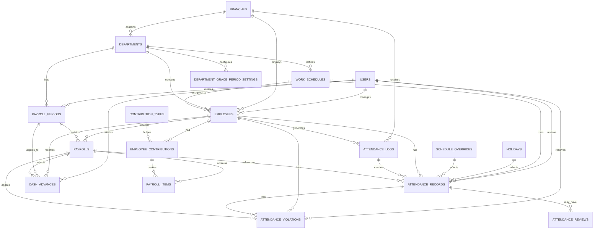
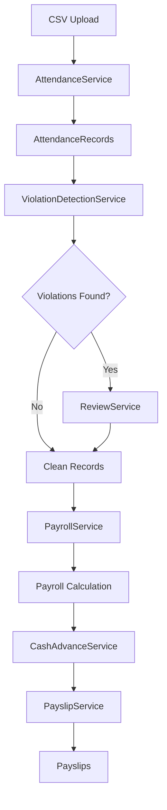

# Comprehensive System Architecture Design
## Attendance & Payroll System

### Overview

This document provides a complete system architecture for the Attendance and Payroll System, covering database schema, API architecture, service layer organization, UI component architecture, system integration points, performance considerations, error handling, and validation strategies.

The system integrates three core domains:
1. **Attendance Processing** - Raw log import, auto-processing, violation detection, human review
2. **Payroll Calculation** - Period management, payroll generation, deduction application
3. **Cash Advances** - Advance creation, tracking, and payroll integration

---

## 1. Database Schema Design

### 1.1 Entity-Relationship Diagram



### 1.2 Core Tables

#### attendance_logs
```sql
CREATE TABLE attendance_logs (
    id BIGSERIAL PRIMARY KEY,
    employee_id BIGINT REFERENCES employees(id) ON DELETE CASCADE,
    employee_code VARCHAR(50) NOT NULL,
    log_datetime TIMESTAMP NOT NULL,
    log_type VARCHAR(10) NOT NULL, -- 'IN' or 'OUT'
    device_id VARCHAR(50),
    branch_id BIGINT REFERENCES branches(id),
    source_file VARCHAR(255),
    processed BOOLEAN DEFAULT false,
    created_at TIMESTAMP,
    updated_at TIMESTAMP,
    
    INDEX idx_employee_date (employee_id, log_datetime),
    INDEX idx_log_datetime (log_datetime),
    INDEX idx_processed (processed)
);
```

#### attendance_records
```sql
CREATE TABLE attendance_records (
    id BIGSERIAL PRIMARY KEY,
    employee_id BIGINT REFERENCES employees(id) ON DELETE CASCADE,
    attendance_date DATE NOT NULL,
    schedule_id BIGINT REFERENCES work_schedules(id),
    
    time_in_am TIME,
    time_out_lunch TIME,
    time_in_pm TIME,
    time_out_pm TIME,
    
    late_minutes_am INTEGER DEFAULT 0,
    late_minutes_pm INTEGER DEFAULT 0,
    total_late_minutes INTEGER GENERATED ALWAYS AS (late_minutes_am + late_minutes_pm) STORED,
    undertime_minutes INTEGER DEFAULT 0,
    overtime_minutes INTEGER DEFAULT 0,
    rendered DECIMAL(4,2) DEFAULT 0.00,
    
    missed_logs_count INTEGER DEFAULT 0,
    confidence_score INTEGER DEFAULT 100,
    status VARCHAR(20) DEFAULT 'clean',
    remarks TEXT,
    
    processed_at TIMESTAMP,
    reviewed_by BIGINT REFERENCES users(id),
    reviewed_at TIMESTAMP,
    
    created_at TIMESTAMP,
    updated_at TIMESTAMP,
    
    UNIQUE(employee_id, attendance_date),
    INDEX idx_employee_date (employee_id, attendance_date),
    INDEX idx_status (status),
    INDEX idx_attendance_date (attendance_date)
);
```

#### attendance_violations
```sql
CREATE TABLE attendance_violations (
    id BIGSERIAL PRIMARY KEY,
    attendance_record_id BIGINT REFERENCES attendance_records(id) ON DELETE CASCADE,
    employee_id BIGINT REFERENCES employees(id) ON DELETE CASCADE,
    attendance_date DATE NOT NULL,
    
    violation_type VARCHAR(50) NOT NULL,
    severity VARCHAR(20) NOT NULL,
    description TEXT,
    
    log_time TIME,
    log_count INTEGER,
    duration_minutes INTEGER,
    
    resolved BOOLEAN DEFAULT false,
    resolution_notes TEXT,
    resolved_by BIGINT REFERENCES users(id),
    resolved_at TIMESTAMP,
    
    created_at TIMESTAMP,
    updated_at TIMESTAMP,
    
    INDEX idx_employee_date (employee_id, attendance_date),
    INDEX idx_violation_type (violation_type),
    INDEX idx_severity (severity),
    INDEX idx_resolved (resolved)
);
```

#### payroll_periods
```sql
CREATE TABLE payroll_periods (
    id BIGSERIAL PRIMARY KEY,
    department_id BIGINT REFERENCES departments(id) ON DELETE CASCADE,
    start_date DATE NOT NULL,
    end_date DATE NOT NULL,
    payroll_date DATE NOT NULL,
    status VARCHAR(20) DEFAULT 'OPEN',
    
    created_by BIGINT REFERENCES users(id),
    finalized_by BIGINT REFERENCES users(id),
    finalized_at TIMESTAMP,
    
    created_at TIMESTAMP,
    updated_at TIMESTAMP,
    
    INDEX idx_department_status (department_id, status),
    INDEX idx_date_range (start_date, end_date)
);
```

#### payrolls
```sql
CREATE TABLE payrolls (
    id BIGSERIAL PRIMARY KEY,
    payroll_period_id BIGINT REFERENCES payroll_periods(id) ON DELETE CASCADE,
    employee_id BIGINT REFERENCES employees(id) ON DELETE CASCADE,
    
    basic_pay DECIMAL(12,2) DEFAULT 0.00,
    overtime_pay DECIMAL(12,2) DEFAULT 0.00,
    gross_pay DECIMAL(12,2) DEFAULT 0.00,
    
    total_earnings DECIMAL(12,2) DEFAULT 0.00,
    total_deductions DECIMAL(12,2) DEFAULT 0.00,
    net_pay DECIMAL(12,2) DEFAULT 0.00,
    
    status VARCHAR(20) DEFAULT 'DRAFT',
    notes TEXT,
    
    created_at TIMESTAMP,
    updated_at TIMESTAMP,
    
    UNIQUE(payroll_period_id, employee_id),
    INDEX idx_period_status (payroll_period_id, status),
    INDEX idx_employee_period (employee_id, payroll_period_id)
);
```

#### payroll_items
```sql
CREATE TABLE payroll_items (
    id BIGSERIAL PRIMARY KEY,
    payroll_id BIGINT REFERENCES payrolls(id) ON DELETE CASCADE,
    
    type VARCHAR(20) NOT NULL, -- 'EARNING' or 'DEDUCTION'
    category VARCHAR(100) NOT NULL,
    amount DECIMAL(12,2) NOT NULL,
    
    reference_type VARCHAR(50),
    reference_id BIGINT,
    
    created_at TIMESTAMP,
    updated_at TIMESTAMP,
    
    INDEX idx_payroll_type (payroll_id, type),
    INDEX idx_reference (reference_type, reference_id)
);
```

#### cash_advances
```sql
CREATE TABLE cash_advances (
    id BIGSERIAL PRIMARY KEY,
    employee_id BIGINT REFERENCES employees(id) ON DELETE CASCADE,
    amount DECIMAL(12,2) NOT NULL,
    reason TEXT,
    
    status VARCHAR(20) DEFAULT 'Active',
    created_by BIGINT REFERENCES users(id),
    
    deduction_date DATE,
    payroll_period_id BIGINT REFERENCES payroll_periods(id),
    
    created_at TIMESTAMP,
    updated_at TIMESTAMP,
    
    INDEX idx_employee_status (employee_id, status),
    INDEX idx_deduction_date (deduction_date)
);
```

### 1.3 Performance Indexes

```sql
-- Attendance processing queries
CREATE INDEX idx_attendance_logs_employee_datetime ON attendance_logs(employee_id, log_datetime DESC);
CREATE INDEX idx_attendance_records_employee_date ON attendance_records(employee_id, attendance_date DESC);
CREATE INDEX idx_attendance_violations_employee_date ON attendance_violations(employee_id, attendance_date DESC);

-- Payroll queries
CREATE INDEX idx_payrolls_period_employee ON payrolls(payroll_period_id, employee_id);
CREATE INDEX idx_payroll_items_payroll_type ON payroll_items(payroll_id, type);

-- Reporting queries
CREATE INDEX idx_attendance_records_status_date ON attendance_records(status, attendance_date);
CREATE INDEX idx_violations_severity_date ON attendance_violations(severity, attendance_date DESC);
CREATE INDEX idx_payroll_periods_department_status ON payroll_periods(department_id, status);
```

---

## 2. API Architecture

### 2.1 RESTful Endpoint Structure

#### Attendance Management
```
GET    /api/attendance/logs              - List raw logs
POST   /api/attendance/logs/import       - Import CSV
GET    /api/attendance/records           - List attendance records
GET    /api/attendance/records/{id}      - Get record details
PUT    /api/attendance/records/{id}      - Update record
GET    /api/attendance/violations        - List violations
GET    /api/attendance/violations/{id}   - Get violation details
PUT    /api/attendance/violations/{id}   - Update violation
GET    /api/attendance/reviews           - Get review queue
POST   /api/attendance/reviews/{id}/approve - Approve review
POST   /api/attendance/reviews/{id}/correct - Apply corrections
```

#### Payroll Management
```
GET    /api/payroll/periods              - List payroll periods
POST   /api/payroll/periods              - Create period
GET    /api/payroll/periods/{id}         - Get period details
POST   /api/payroll/periods/{id}/generate - Generate payroll
GET    /api/payroll/periods/{id}/payrolls - List payrolls in period
GET    /api/payroll/{id}                 - Get payroll details
PUT    /api/payroll/{id}                 - Update payroll
POST   /api/payroll/{id}/finalize        - Finalize payroll
GET    /api/payroll/{id}/payslip         - Get payslip
POST   /api/payroll/periods/{id}/finalize - Finalize period
```

#### Cash Advances
```
GET    /api/cash-advances                - List advances
POST   /api/cash-advances                - Create advance
GET    /api/cash-advances/{id}           - Get advance details
DELETE /api/cash-advances/{id}           - Delete advance
GET    /api/employees/{id}/cash-advances - Get employee advances
POST   /api/payroll/{id}/cash-advances   - Apply deduction
```

### 2.2 Request/Response Schemas

#### Create Payroll Period Request
```json
{
  "department_id": 1,
  "start_date": "2026-01-01",
  "end_date": "2026-01-31",
  "payroll_date": "2026-02-05"
}
```

#### Payroll Response
```json
{
  "id": 1,
  "payroll_period_id": 1,
  "employee_id": 5,
  "employee": {
    "id": 5,
    "name": "John Doe",
    "employee_code": "EMP001"
  },
  "basic_pay": 6750.00,
  "overtime_pay": 156.25,
  "gross_pay": 6906.25,
  "total_earnings": 6906.25,
  "total_deductions": 506.25,
  "net_pay": 6400.00,
  "status": "DRAFT",
  "items": [
    {
      "type": "EARNING",
      "category": "Basic Pay",
      "amount": 6750.00
    },
    {
      "type": "EARNING",
      "category": "Overtime",
      "amount": 156.25
    },
    {
      "type": "DEDUCTION",
      "category": "Late Penalty",
      "amount": 93.75
    }
  ]
}
```

#### Error Response
```json
{
  "success": false,
  "message": "Validation failed",
  "errors": {
    "start_date": ["Start date must be before end date"],
    "daily_rate": ["Daily rate must be positive"]
  }
}
```

### 2.3 Error Handling Patterns

```php
// Standard error responses
200 OK - Successful request
201 Created - Resource created
204 No Content - Successful deletion
400 Bad Request - Validation error
401 Unauthorized - Authentication required
403 Forbidden - Authorization failed
404 Not Found - Resource not found
409 Conflict - Business logic violation
422 Unprocessable Entity - Semantic error
500 Internal Server Error - Server error
```

### 2.4 Authentication & Authorization

```php
// Middleware stack
- auth:sanctum - Verify API token
- verified - Email verification
- role:admin - Admin role check
- permission:manage-payroll - Specific permission

// Role-based access
Admin: Full access to all endpoints
HR Manager: Manage attendance, violations, payroll
Employee: View own payslips
```

---

## 3. Service Layer Organization

### 3.1 Service Classes & Responsibilities

#### AttendanceService
- CSV import and parsing
- Log processing and record creation
- Attendance calculation (late, undertime, overtime)
- Batch processing for date ranges

#### ViolationDetectionService
- Structural violation detection
- Policy violation detection
- Ambiguity scoring
- Violation categorization and severity

#### ReviewService
- Review queue management
- Suggestion approval/rejection
- Manual corrections
- Bulk operations

#### PayrollService
- Payroll period management
- Payroll generation for employees
- Payroll calculation and composition
- Period finalization

#### CashAdvanceService
- Cash advance creation
- Deduction application
- Balance tracking
- Status management

#### PayslipService
- Payslip generation
- Payslip formatting
- PDF generation
- Distribution tracking

### 3.2 Data Flow Between Services



### 3.3 Business Logic Separation

```php
// Service layer handles business logic
PayrollService::calculatePayroll()
  ├─ Fetch attendance records
  ├─ Calculate basic pay
  ├─ Calculate overtime
  ├─ Apply late penalties
  ├─ Apply undertime penalties
  ├─ Apply violation deductions
  ├─ Apply contributions
  └─ Calculate net pay

// Controller handles HTTP concerns
PayrollController::processGeneration()
  ├─ Validate request
  ├─ Call PayrollService
  ├─ Handle errors
  └─ Return response
```

### 3.4 Dependency Injection Patterns

```php
// Constructor injection
class PayrollService
{
    public function __construct(
        private AttendanceRepository $attendanceRepo,
        private ViolationRepository $violationRepo,
        private CashAdvanceRepository $cashAdvanceRepo,
        private PayslipService $payslipService
    ) {}
}

// Service container binding
$container->bind(PayrollService::class, function ($app) {
    return new PayrollService(
        $app->make(AttendanceRepository::class),
        $app->make(ViolationRepository::class),
        $app->make(CashAdvanceRepository::class),
        $app->make(PayslipService::class)
    );
});
```

---

## 4. UI Component Architecture

### 4.1 Page Structure & Navigation

```
Dashboard
├── Attendance Module
│   ├── Attendance Summary
│   ├── Raw Logs
│   ├── Violations
│   └── Review Queue
├── Payroll Module
│   ├── Payroll Periods
│   ├── Generate Payroll
│   ├── Period Details
│   └── Payslips
├── Cash Advances Module
│   ├── Advances List
│   ├── Create Advance
│   └── Deduction History
└── Settings
    ├── Grace Period Settings
    ├── Work Schedules
    └── Processing Configuration
```

### 4.2 Component Hierarchy

```
App
├── Layout
│   ├── Header
│   ├── Sidebar
│   └── MainContent
├── Pages
│   ├── Attendance
│   │   ├── AttendanceSummary
│   │   ├── RawLogsTable
│   │   ├── ViolationsTable
│   │   └── ReviewQueueList
│   ├── Payroll
│   │   ├── PayrollPeriodsList
│   │   ├── GeneratePayrollForm
│   │   ├── PeriodDetails
│   │   └── PayslipView
│   └── CashAdvances
│       ├── AdvancesList
│       ├── CreateAdvanceForm
│       └── DeductionHistory
└── Components
    ├── DataTable
    ├── Modal
    ├── Form
    ├── StatusBadge
    └── ConfirmDialog
```

### 4.3 State Management

```javascript
// Global state (Inertia/React Context)
{
  auth: { user, permissions },
  attendance: { records, violations, reviews },
  payroll: { periods, payrolls, payslips },
  cashAdvances: { advances, deductions },
  ui: { loading, errors, notifications }
}

// Component state
- Form inputs
- Modal visibility
- Table sorting/filtering
- Pagination
```

### 4.4 Data Flow from API to UI

```
API Response
  ↓
Service Layer (Transform data)
  ↓
State Management (Store data)
  ↓
Component Props (Pass to components)
  ↓
UI Rendering (Display to user)
  ↓
User Interaction (Form submission)
  ↓
API Request (Send to backend)
```

---

## 5. System Integration Points

### 5.1 Attendance → Payroll Flow

```
Attendance Records
  ├─ Days Worked (rendered field)
  ├─ Late Minutes (late_minutes_am + late_minutes_pm)
  ├─ Overtime Minutes (overtime_minutes)
  └─ Undertime Minutes (undertime_minutes)
        ↓
Payroll Calculation
  ├─ Basic Pay = Days Worked × Daily Rate
  ├─ Overtime Pay = (Overtime Minutes ÷ 60) × Hourly Rate × 1.25
  ├─ Late Penalty = (Late Minutes ÷ 60) × Hourly Rate
  └─ Undertime Penalty = (Undertime Minutes ÷ 60) × Hourly Rate
```

### 5.2 Violations → Payroll Deductions

```
Attendance Violations
  ├─ Cumulative Grace Period Violation
  │   └─ Deduction = (Deductible Minutes ÷ 60) × Hourly Rate
  ├─ Unexcused Absence
  │   └─ Deduction = 1.0 × Daily Rate
  └─ AWOL
      └─ Deduction = 3.0 × Daily Rate
        ↓
Payroll Items (Violation Deduction category)
  └─ Applied during payroll generation
```

### 5.3 Cash Advances Integration

```
Cash Advances
  ├─ Active Status
  ├─ Amount
  └─ Employee
        ↓
Payroll Generation
  ├─ Display deductible advances
  ├─ Admin selects advances to deduct
  └─ Create PayrollItem (Cash Advance category)
        ↓
Payroll Finalization
  └─ Update cash_advance status to "Completed"
```

### 5.4 Audit Trail & Reporting

```
Audit Events
├─ Attendance Record Created
├─ Attendance Record Reviewed
├─ Violation Detected
├─ Violation Resolved
├─ Payroll Generated
├─ Payroll Finalized
├─ Cash Advance Created
└─ Cash Advance Deducted

Audit Trail Table
├─ user_id (who performed action)
├─ action (what was done)
├─ model_type (what was affected)
├─ model_id (which record)
├─ changes (what changed)
└─ created_at (when)
```

---

## 6. Performance Considerations

### 6.1 Database Query Optimization

```php
// Use eager loading to prevent N+1 queries
$payrolls = Payroll::with([
    'employee',
    'payrollPeriod',
    'items',
    'items.reference'
])->get();

// Use indexes for common queries
SELECT * FROM attendance_records 
WHERE employee_id = ? AND attendance_date BETWEEN ? AND ?
INDEX: idx_employee_date

// Batch operations for large datasets
$records = AttendanceRecord::where('status', 'clean')
    ->chunk(1000, function ($chunk) {
        // Process 1000 records at a time
    });
```

### 6.2 Caching Strategies

```php
// Cache employee data
Cache::remember("employee:{$id}", 3600, function () {
    return Employee::with('contributions')->find($id);
});

// Cache configuration values
Cache::remember('processing_config', 86400, function () {
    return ProcessingConfiguration::all()->keyBy('config_key');
});

// Cache payroll calculations
Cache::remember("payroll:{$periodId}:summary", 1800, function () {
    return Payroll::where('payroll_period_id', $periodId)
        ->selectRaw('SUM(gross_pay) as total_gross, SUM(net_pay) as total_net')
        ->first();
});
```

### 6.3 Batch Processing for Large Payrolls

```php
// Process payroll in batches
public function generatePayroll(PayrollPeriod $period)
{
    $employees = Employee::where('department_id', $period->department_id)
        ->where('status', 'active')
        ->chunk(100);
    
    foreach ($employees as $chunk) {
        foreach ($chunk as $employee) {
            $this->generateEmployeePayroll($period, $employee);
        }
        
        // Clear memory after each batch
        Cache::flush();
    }
}
```

### 6.4 API Response Optimization

```php
// Pagination for large datasets
$payrolls = Payroll::where('payroll_period_id', $periodId)
    ->paginate(50);

// Selective field loading
$payrolls = Payroll::select('id', 'employee_id', 'gross_pay', 'net_pay')
    ->with('employee:id,name')
    ->get();

// Response compression
header('Content-Encoding: gzip');
```

---

## 7. Error Handling & Validation

### 7.1 Input Validation Rules

```php
// Payroll period validation
$validated = $request->validate([
    'department_id' => 'required|exists:departments,id',
    'start_date' => 'required|date|before:end_date',
    'end_date' => 'required|date|after:start_date',
    'payroll_date' => 'required|date|after:end_date',
]);

// Payroll calculation validation
$this->validate([
    'daily_rate' => 'required|numeric|min:0.01',
    'attendance_records' => 'required|array|min:1',
    'deductions' => 'array|numeric|min:0',
]);

// Cash advance validation
$validated = $request->validate([
    'employee_id' => 'required|exists:employees,id',
    'amount' => 'required|numeric|min:0.01',
    'reason' => 'nullable|string|max:255',
]);
```

### 7.2 Error Response Formats

```json
{
  "success": false,
  "message": "Payroll generation failed",
  "error_code": "PAYROLL_001",
  "details": {
    "missing_records": ["2026-01-01", "2026-01-02"],
    "invalid_rates": [5, 12, 18]
  },
  "timestamp": "2026-01-15T10:30:00Z"
}
```

### 7.3 Logging & Monitoring

```php
// Log all payroll operations
Log::info('Payroll generated', [
    'period_id' => $period->id,
    'employee_count' => $count,
    'total_gross' => $totalGross,
    'duration_ms' => $duration,
]);

// Monitor performance
Monitoring::recordMetric('payroll_generation_time', $duration);
Monitoring::recordMetric('payroll_error_rate', $errorCount / $totalCount);

// Alert on critical errors
if ($errorCount > 0) {
    Alert::critical('Payroll generation errors detected', [
        'period_id' => $period->id,
        'error_count' => $errorCount,
    ]);
}
```

### 7.4 Recovery Mechanisms

```php
// Rollback on error
DB::transaction(function () {
    $payroll = Payroll::create($data);
    $this->createPayrollItems($payroll);
    
    // If any error occurs, entire transaction rolls back
});

// Retry logic for transient failures
$maxRetries = 3;
$attempt = 0;

while ($attempt < $maxRetries) {
    try {
        $this->generatePayroll($period);
        break;
    } catch (Exception $e) {
        $attempt++;
        if ($attempt >= $maxRetries) {
            throw $e;
        }
        sleep(2 ** $attempt); // Exponential backoff
    }
}
```

---

## 8. Configuration & Customization

### 8.1 System Configuration

```php
// Processing configuration
DOUBLE_TAP_THRESHOLD = 2 minutes
RAPID_RETAP_THRESHOLD = 5 minutes
SHORT_SESSION_THRESHOLD = 4 hours
LONG_LUNCH_THRESHOLD = 2 hours
AMBIGUOUS_CONFIDENCE_THRESHOLD = 70%

// Payroll configuration
OVERTIME_MULTIPLIER = 1.25
LATE_PENALTY_CALCULATION = (minutes ÷ 60) × hourly_rate
UNDERTIME_PENALTY_CALCULATION = (minutes ÷ 60) × hourly_rate
AWOL_DEDUCTION_DAYS = 3
```

### 8.2 Department-Specific Settings

```php
// Grace period settings per department
Department A: 15 minutes grace period
Department B: 10 minutes grace period
Department C: 0 minutes grace period

// Work schedule per department
Department A: 8:00 AM - 5:00 PM (1 hour lunch)
Department B: 9:00 AM - 6:00 PM (1 hour lunch)
Department C: 7:00 AM - 4:00 PM (30 min lunch)
```

---

## 9. Security Considerations

### 9.1 Data Protection

```php
// Encrypt sensitive data
- Employee personal information
- Salary information
- Cash advance amounts

// Access control
- Role-based access (Admin, HR Manager, Employee)
- Permission-based access (manage-payroll, view-payslips)
- Row-level security (employees can only view own payslips)

// Audit trail
- Log all payroll modifications
- Track who made changes and when
- Maintain immutable audit records
```

### 9.2 API Security

```php
// Authentication
- API token validation
- Email verification
- Session management

// Authorization
- Role-based access control
- Permission checking
- Resource ownership validation

// Input validation
- Sanitize all inputs
- Validate data types
- Check business logic constraints
```

---

## 10. Deployment & Maintenance

### 10.1 Database Migrations

```bash
# Run migrations in order
php artisan migrate

# Rollback if needed
php artisan migrate:rollback

# Refresh database
php artisan migrate:refresh --seed
```

### 10.2 Monitoring & Alerts

```
- Monitor payroll generation time
- Alert on validation errors
- Track API response times
- Monitor database query performance
- Alert on failed transactions
```

### 10.3 Backup & Recovery

```
- Daily database backups
- Point-in-time recovery capability
- Backup verification
- Disaster recovery plan
```

---

## Summary

This comprehensive architecture provides:

1. **Scalable Database Design** - Normalized schema with proper indexes
2. **RESTful API** - Clear endpoint structure with consistent patterns
3. **Service-Oriented Architecture** - Separation of concerns and reusability
4. **Component-Based UI** - Modular and maintainable frontend
5. **Seamless Integration** - Clear data flow between domains
6. **Performance Optimization** - Caching, indexing, and batch processing
7. **Robust Error Handling** - Validation, logging, and recovery
8. **Security & Compliance** - Access control and audit trails

The system is designed to handle complex attendance processing, accurate payroll calculation, and seamless cash advance integration while maintaining data integrity and system performance.
