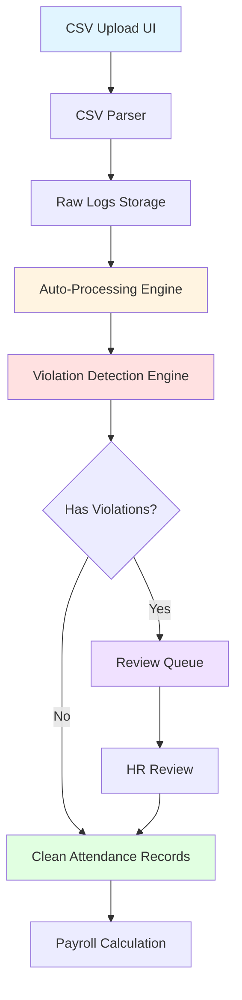
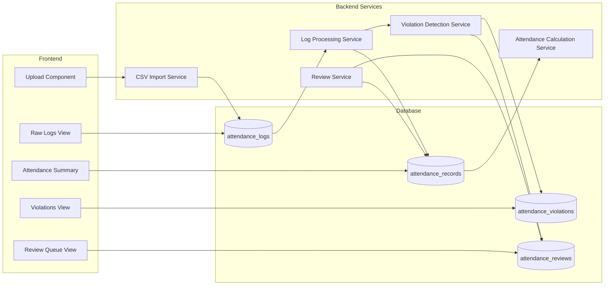

# Design Document: Attendance Processing Enhancement

## Overview

This design implements a 3-level safety architecture for attendance processing that intelligently handles complex and ambiguous log patterns. The system consists of three layers:

1. **Auto-Processing Engine**: Automatically interprets raw logs using pattern recognition and time-based inference
2. **Violation Detection Engine**: Flags structural and policy-based attendance issues
3. **Human Review Layer**: Provides HR users with a queue of ambiguous cases requiring manual review

The attendance module is restructured into 4 distinct subpages to improve visibility, debugging capabilities, and HR workflow efficiency:

- **Attendance (Main)**: Summary view with processing status and violation counts
- **Raw Logs**: Complete audit trail of imported device logs
- **Violations**: Centralized view of all detected attendance issues
- **Review Queue**: Prioritized queue of ambiguous cases requiring HR review

### Design Goals

- Handle messy real-world attendance data (double-taps, misclicks, forgotten logs)
- Provide fault-tolerant processing that never breaks payroll
- Give HR visibility into data quality issues
- Enable efficient manual review of ambiguous cases
- Maintain complete audit trail for compliance

## Architecture

### High-Level System Flow



### Detailed Processing Flow

```
CSV Upload UI
    ↓
CSV Parser (Normalize records)
    ↓
Raw Logs (attendance_logs)
    ↓
Log Processing Engine
    ├─ Sort logs chronologically
    ├─ Filter double-taps (< 2 min)
    ├─ Detect patterns (forgot logout, misclick, etc.)
    └─ Assign logs to time slots
    ↓
Attendance Record Creation
    ├─ Calculate late/undertime/overtime
    └─ Set initial status
    ↓
Violation Detection Engine
    ├─ Structural violations (unpaired logs, excess logs)
    ├─ Policy violations (late, early out, short session)
    └─ Ambiguity detection (confidence scoring)
    ↓
    ├─→ Clean Records (attendance_records)
    └─→ Flagged Records
         ├─→ Violations Table (attendance_violations)
         └─→ Review Queue (attendance_reviews)
              ↓
         HR Review Interface
              ├─ Approve suggestion
              ├─ Manual edit
              └─ Mark as valid
              ↓
         Approved Attendance
              ↓
         Payroll Calculation
```

### Component Architecture




## Components and Interfaces

### 1. CSV Import Service

**Responsibility**: Parse uploaded CSV files and store raw logs

**Interface**:
```php
class CsvImportService
{
    /**
     * Import attendance logs from CSV file
     * 
     * @param UploadedFile $file
     * @return array ['success' => bool, 'imported' => int, 'errors' => array]
     */
    public function importCsv(UploadedFile $file): array;
    
    /**
     * Validate CSV format and structure
     * 
     * @param UploadedFile $file
     * @return array ['valid' => bool, 'errors' => array]
     */
    public function validateCsvFormat(UploadedFile $file): array;
    
    /**
     * Parse CSV row into raw log entry
     * 
     * @param array $row
     * @param string $sourceFile
     * @return AttendanceLog|null
     */
    private function parseRow(array $row, string $sourceFile): ?AttendanceLog;
}
```

**Key Operations**:
- Validate CSV structure (required columns: employee_code, timestamp, log_type)
- Normalize timestamps to consistent format
- Store each log with source file reference
- Handle duplicate detection (same employee, timestamp, type)
- Return import summary with success/error counts

### 2. Log Processing Service

**Responsibility**: Transform raw logs into structured attendance records

**Interface**:
```php
class LogProcessingService
{
    /**
     * Process raw logs for a date range
     * 
     * @param Carbon $startDate
     * @param Carbon $endDate
     * @return array ['processed' => int, 'flagged' => int]
     */
    public function processLogsForDateRange(Carbon $startDate, Carbon $endDate): array;
    
    /**
     * Process logs for a single employee on a specific date
     * 
     * @param int $employeeId
     * @param Carbon $date
     * @return AttendanceRecord
     */
    public function processEmployeeDayLogs(int $employeeId, Carbon $date): AttendanceRecord;
    
    /**
     * Filter double-tap logs (within threshold)
     * 
     * @param Collection $logs
     * @param int $thresholdMinutes
     * @return Collection
     */
    private function filterDoubleTaps(Collection $logs, int $thresholdMinutes = 2): Collection;
    
    /**
     * Detect and handle rapid re-tap pattern (IN-OUT-IN within 5 min)
     * 
     * @param Collection $logs
     * @return Collection
     */
    private function handleRapidRetap(Collection $logs): Collection;
    
    /**
     * Assign logs to time slots (morning_in, lunch_out, lunch_in, afternoon_out)
     * 
     * @param Collection $logs
     * @param WorkSchedule $schedule
     * @return array
     */
    private function assignLogsToTimeSlots(Collection $logs, WorkSchedule $schedule): array;
    
    /**
     * Calculate confidence score for log interpretation
     * 
     * @param Collection $logs
     * @param array $assignment
     * @return int (0-100)
     */
    private function calculateConfidenceScore(Collection $logs, array $assignment): int;
}
```

**Processing Algorithm**:

```
For each employee per day:
1. Fetch all raw logs for that date
2. Sort logs chronologically
3. Filter double-taps (logs within 2 minutes)
4. Detect and handle rapid re-tap (IN-OUT-IN < 5 min → single IN)
5. Detect pattern type:
   - 4 logs: Standard day (IN, OUT lunch, IN lunch, OUT)
   - 2 logs: Half day or forgot lunch logs
   - 1 log: Forgot logout or forgot login
   - 3 logs: Misclick or forgot one log
   - 5+ logs: Extra clicks or multiple entries
6. Assign logs to slots using time-based inference:
   - Morning IN: First log or log closest to schedule start
   - Lunch OUT: Log around lunch time (11:30-13:00)
   - Lunch IN: Log after lunch out (12:30-14:00)
   - Afternoon OUT: Last log or log closest to schedule end
7. Calculate metrics:
   - Late minutes (AM and PM)
   - Undertime minutes
   - Overtime minutes
   - Total rendered hours
8. Calculate confidence score based on:
   - Log count (4 = 100%, 2 = 80%, 1 = 40%, 3/5+ = 60%)
   - Time spacing regularity
   - Alignment with schedule
9. Create attendance record with status
```

**Pattern Detection Examples**:

| Pattern | Logs | Interpretation | Confidence |
|---------|------|----------------|------------|
| Standard | 08:00 IN, 12:00 OUT, 13:00 IN, 17:00 OUT | Normal day | 100% |
| Double-tap | 08:00 IN, 08:01 IN, 12:00 OUT, 13:00 IN, 17:00 OUT | Merge first two → Normal | 95% |
| Forgot logout | 08:00 IN | Use schedule end time | 40% |
| Forgot lunch | 08:00 IN, 17:00 OUT | Assume lunch break | 80% |
| Misclick | 08:00 IN, 12:00 OUT, 12:01 OUT, 13:00 IN, 17:00 OUT | Remove duplicate OUT | 90% |
| Rapid re-tap | 08:00 IN, 08:03 OUT, 08:04 IN, 12:00 OUT, 13:00 IN, 17:00 OUT | Treat first 3 as single IN | 85% |
| Extra clicks | 08:00 IN, 08:05 IN, 08:10 IN, 17:00 OUT | Use first and last | 70% |

### 3. Violation Detection Service

**Responsibility**: Identify and categorize attendance violations

**Interface**:
```php
class ViolationDetectionService
{
    /**
     * Detect all violations for an attendance record
     * 
     * @param AttendanceRecord $record
     * @param Collection $rawLogs
     * @return Collection<AttendanceViolation>
     */
    public function detectViolations(AttendanceRecord $record, Collection $rawLogs): Collection;
    
    /**
     * Check for structural violations (log patterns)
     * 
     * @param Collection $rawLogs
     * @return array
     */
    private function checkStructuralViolations(Collection $rawLogs): array;
    
    /**
     * Check for policy violations (late, undertime, etc.)
     * 
     * @param AttendanceRecord $record
     * @param WorkSchedule $schedule
     * @return array
     */
    private function checkPolicyViolations(AttendanceRecord $record, WorkSchedule $schedule): array;
    
    /**
     * Determine if case is ambiguous and needs review
     * 
     * @param AttendanceRecord $record
     * @param Collection $rawLogs
     * @param int $confidenceScore
     * @return bool
     */
    private function isAmbiguousCase(AttendanceRecord $record, Collection $rawLogs, int $confidenceScore): bool;
    
    /**
     * Calculate violation severity
     * 
     * @param string $violationType
     * @param mixed $violationData
     * @return string (Low|Medium|High)
     */
    private function calculateSeverity(string $violationType, $violationData): string;
}
```

**Violation Types**:

| Type | Description | Severity | Trigger |
|------|-------------|----------|---------|
| NO_LOG | No logs for workday | High | 0 logs on scheduled workday |
| UNPAIRED_LOG | Odd number of logs | Medium | 1, 3, 5, 7... logs after filtering |
| EXCESS_LOGS | Too many logs | Medium | > 4 logs after filtering |
| SHORT_SESSION | Work session < 4 hours | High | Total work time < 4 hours |
| LONG_LUNCH | Lunch break > 2 hours | Low | Lunch duration > 2 hours |
| LATE_MORNING | Late arrival | Low/Medium | time_in_am > 9:00 AM |
| EARLY_OUT | Early departure | Medium | time_out_pm < 5:00 PM |
| MISSING_LUNCH_OUT | No lunch out log | Low | Has lunch_in but no lunch_out |
| MISSING_LUNCH_IN | No lunch in log | Low | Has lunch_out but no lunch_in |

**Ambiguous Case Detection**:

Cases requiring manual review (confidence < 70%):
- Exactly 1 log (forgot login or logout?)
- Exactly 3 logs with irregular spacing (> 30 min gaps)
- Exactly 5 logs with irregular spacing
- Logs spanning > 14 hours
- Multiple rapid re-taps in same day
- Conflicting log types (IN-IN-OUT pattern)

### 4. Review Service

**Responsibility**: Manage human review workflow

**Interface**:
```php
class ReviewService
{
    /**
     * Add record to review queue
     * 
     * @param AttendanceRecord $record
     * @param string $issue
     * @param array $suggestedFix
     * @return AttendanceReview
     */
    public function addToReviewQueue(AttendanceRecord $record, string $issue, array $suggestedFix): AttendanceReview;
    
    /**
     * Get prioritized review queue
     * 
     * @param array $filters
     * @return Collection<AttendanceReview>
     */
    public function getReviewQueue(array $filters = []): Collection;
    
    /**
     * Approve suggested fix
     * 
     * @param int $reviewId
     * @param int $reviewerId
     * @return bool
     */
    public function approveSuggestion(int $reviewId, int $reviewerId): bool;
    
    /**
     * Apply manual corrections
     * 
     * @param int $reviewId
     * @param array $corrections
     * @param int $reviewerId
     * @return bool
     */
    public function applyManualCorrections(int $reviewId, array $corrections, int $reviewerId): bool;
    
    /**
     * Mark record as valid (accept current interpretation)
     * 
     * @param int $reviewId
     * @param int $reviewerId
     * @return bool
     */
    public function markAsValid(int $reviewId, int $reviewerId): bool;
    
    /**
     * Bulk approve similar cases
     * 
     * @param array $reviewIds
     * @param int $reviewerId
     * @return array ['success' => int, 'failed' => int]
     */
    public function bulkApprove(array $reviewIds, int $reviewerId): array;
}
```

**Review Queue Priority**:
1. High severity violations first
2. Older records before newer
3. Records blocking payroll calculation

### 5. Attendance Calculation Service

**Responsibility**: Calculate final attendance metrics for payroll

**Interface**:
```php
class AttendanceCalculationService
{
    /**
     * Calculate late minutes (AM and PM)
     * 
     * @param AttendanceRecord $record
     * @param WorkSchedule $schedule
     * @return array ['am' => int, 'pm' => int]
     */
    public function calculateLateMinutes(AttendanceRecord $record, WorkSchedule $schedule): array;
    
    /**
     * Calculate undertime minutes
     * 
     * @param AttendanceRecord $record
     * @param WorkSchedule $schedule
     * @return int
     */
    public function calculateUndertimeMinutes(AttendanceRecord $record, WorkSchedule $schedule): int;
    
    /**
     * Calculate overtime minutes
     * 
     * @param AttendanceRecord $record
     * @param WorkSchedule $schedule
     * @return int
     */
    public function calculateOvertimeMinutes(AttendanceRecord $record, WorkSchedule $schedule): int;
    
    /**
     * Calculate total rendered hours
     * 
     * @param AttendanceRecord $record
     * @return float
     */
    public function calculateRenderedHours(AttendanceRecord $record): float;
    
    /**
     * Check if all records are ready for payroll
     * 
     * @param Carbon $startDate
     * @param Carbon $endDate
     * @return array ['ready' => bool, 'pending_reviews' => int]
     */
    public function checkPayrollReadiness(Carbon $startDate, Carbon $endDate): array;
}
```

### 6. Frontend Components

#### Upload Component
- File input with drag-and-drop
- CSV format validation
- Progress indicator
- Import summary display

#### Raw Logs View
- Filterable data table (employee, date range, status)
- Sortable columns
- Pagination
- Export to CSV functionality
- Status indicators (Unprocessed, Processed, Flagged)

#### Violations View
- Filterable data table (employee, date, type, severity, status)
- Violation type badges with color coding
- Expandable row details showing all related logs
- Bulk actions (mark reviewed, add notes)
- Summary cards showing violation counts by type

#### Review Queue View
- Prioritized list (high severity first)
- Expandable cards showing:
  - Employee info
  - All raw logs with timestamps
  - Detected issue description
  - Suggested fix
  - Action buttons (Approve, Edit, Mark Valid)
- Bulk selection and approval
- Real-time queue count updates

#### Attendance Summary (Enhanced)
- Processing status indicator
- Violation count badges (clickable to filter)
- Review queue count badge
- Department and date range filters
- Export functionality


## Data Models

### Database Schema

#### Existing Tables (Leveraged)

**employees**
```sql
CREATE TABLE employees (
    id BIGSERIAL PRIMARY KEY,
    employee_code VARCHAR(50) UNIQUE NOT NULL,
    first_name VARCHAR(100) NOT NULL,
    last_name VARCHAR(100) NOT NULL,
    department_id BIGINT REFERENCES departments(id),
    schedule_id BIGINT REFERENCES work_schedules(id),
    status VARCHAR(20) DEFAULT 'active',
    created_at TIMESTAMP,
    updated_at TIMESTAMP
);
```
**departments**
```sql
**departments**
```sql
CREATE TABLE departments (
    id BIGSERIAL PRIMARY KEY,
    name VARCHAR(100) NOT NULL,
    created_at TIMESTAMP,
    updated_at TIMESTAMP
);
```

**work_schedules**
```sql
CREATE TABLE work_schedules (
    id BIGSERIAL PRIMARY KEY,
    department_id BIGINT REFERENCES departments(id) ON DELETE CASCADE,
    name VARCHAR(100) NOT NULL,
    work_start_time TIME NOT NULL,
    work_end_time TIME NOT NULL,
    break_start_time TIME,
    break_end_time TIME,
    grace_period_minutes INTEGER DEFAULT 0,
    is_working_day BOOLEAN DEFAULT true,
**work_schedules**
```sql
CREATE TABLE work_schedules (
    id BIGSERIAL PRIMARY KEY,
    department_id BIGINT REFERENCES departments(id) ON DELETE CASCADE,
    name VARCHAR(100) NOT NULL,
    work_start_time TIME NOT NULL,
    work_end_time TIME NOT NULL,
    break_start_time TIME,
    break_end_time TIME,
    grace_period_minutes INTEGER DEFAULT 0,
    is_working_day BOOLEAN DEFAULT true,
    half_day_hours DECIMAL(4,2) DEFAULT 4.00,
    created_at TIMESTAMP,
    updated_at TIMESTAMP
);
```

**holidays**
**schedule_overrides**
```sql
CREATE TABLE schedule_overrides (
    id BIGSERIAL PRIMARY KEY,
    date DATE NOT NULL,
   
    schedule_id BIGINT REFERENCES work_schedules(id),
    reason VARCHAR(255),
    created_at TIMESTAMP,
    updated_at TIMESTAMP
);
```
**schedule_overrides**
```sql
CREATE TABLE schedule_overrides (
    id BIGSERIAL PRIMARY KEY,
    date DATE NOT NULL,
    department_id BIGINT REFERENCES departments(id),
    schedule_id BIGINT REFERENCES work_schedules(id),
    reason VARCHAR(255),
    created_at TIMESTAMP,
    updated_at TIMESTAMP
);
``` device_id VARCHAR(50),
    branch_id BIGINT REFERENCES branches(id),
    source_file VARCHAR(255), -- CSV filename for audit trail
    processed BOOLEAN DEFAULT false,
    created_at TIMESTAMP,
    updated_at TIMESTAMP,
    
    INDEX idx_employee_date (employee_id, log_datetime),
    INDEX idx_log_datetime (log_datetime),
    INDEX idx_source_file (source_file),
    INDEX idx_processed (processed)
);
    device_id VARCHAR(50),
    department_id BIGINT REFERENCES departments(id),
    source_file VARCHAR(255), -- CSV filename for audit trail
- `employee_id` added for foreign key relationship
- `employee_code` retained for CSV import (before employee lookup)
- `device_id` and `branch_id` added for multi-location support
- `processed` flag tracks which logs have been processed
- Never modified after creation (immutable audit trail)

**attendance_records** (Enhanced)
```sql
CREATE TABLE attendance_records (
    id BIGSERIAL PRIMARY KEY,
    employee_id BIGINT REFERENCES employees(id) ON DELETE CASCADE,
**Key Design Decisions**:
- `employee_id` added for foreign key relationship
- `employee_code` retained for CSV import (before employee lookup)
- `device_id` and `department_id` added for multi-location support
- `processed` flag tracks which logs have been processed
- Never modified after creation (immutable audit trail)
    time_in_pm TIME,
    time_out_pm TIME,
    
    -- Calculated metrics
    late_minutes_am INTEGER DEFAULT 0,
    late_minutes_pm INTEGER DEFAULT 0,
    total_late_minutes INTEGER GENERATED ALWAYS AS (late_minutes_am + late_minutes_pm) STORED,
    undertime_minutes INTEGER DEFAULT 0,
    overtime_minutes INTEGER DEFAULT 0,
    rendered DECIMAL(4,2) DEFAULT 0.00, -- Total hours worked
    
    -- Processing metadata
    missed_logs_count INTEGER DEFAULT 0,
    confidence_score INTEGER DEFAULT 100, -- 0-100
    status VARCHAR(20) DEFAULT 'clean', -- clean, flagged, reviewed, approved
    remarks TEXT,
    
    -- Audit trail
    processed_at TIMESTAMP,
    reviewed_by BIGINT REFERENCES users(id),
    reviewed_at TIMESTAMP,
    
    created_at TIMESTAMP,
    updated_at TIMESTAMP,
    
    UNIQUE(employee_id, attendance_date),
    INDEX idx_employee_date (employee_id, attendance_date),
    INDEX idx_status (status),
    INDEX idx_attendance_date (attendance_date)
);
```

**Key Enhancements**:
- `confidence_score` tracks auto-processing confidence
- `status` tracks processing state (clean/flagged/reviewed/approved)
- `reviewed_by` and `reviewed_at` for audit trail
- `missed_logs_count` tracks how many logs were missing

**attendance_violations** (New)
```sql
CREATE TABLE attendance_violations (
    id BIGSERIAL PRIMARY KEY,
    attendance_record_id BIGINT REFERENCES attendance_records(id) ON DELETE CASCADE,
    employee_id BIGINT REFERENCES employees(id) ON DELETE CASCADE,
    attendance_date DATE NOT NULL,
    
    violation_type VARCHAR(50) NOT NULL,
    -- NO_LOG, UNPAIRED_LOG, EXCESS_LOGS, SHORT_SESSION, LONG_LUNCH,
    -- LATE_MORNING, EARLY_OUT, MISSING_LUNCH_OUT, MISSING_LUNCH_IN
    
    severity VARCHAR(20) NOT NULL, -- Low, Medium, High
    description TEXT,
    
    -- Related data
    log_time TIME, -- For time-specific violations
    log_count INTEGER, -- For log count violations
    duration_minutes INTEGER, -- For duration violations
    
    -- Resolution tracking
    resolved BOOLEAN DEFAULT false,
    resolution_notes TEXT,
    resolved_by BIGINT REFERENCES users(id),
    resolved_at TIMESTAMP,
    
    created_at TIMESTAMP,
    updated_at TIMESTAMP,
    
    INDEX idx_employee_date (employee_id, attendance_date),
    INDEX idx_violation_type (violation_type),
    INDEX idx_severity (severity),
    INDEX idx_resolved (resolved)
);
```

**attendance_reviews** (New)
```sql
CREATE TABLE attendance_reviews (
    id BIGSERIAL PRIMARY KEY,
    attendance_record_id BIGINT REFERENCES attendance_records(id) ON DELETE CASCADE,
    employee_id BIGINT REFERENCES employees(id) ON DELETE CASCADE,
    attendance_date DATE NOT NULL,
    
    -- Issue details
    issue_type VARCHAR(50) NOT NULL,
    issue_description TEXT NOT NULL,
    
    -- System suggestion
    suggested_fix JSONB, -- Stores suggested time slot assignments
    -- Example: {"time_in_am": "08:00", "time_out_pm": "17:00", "reason": "Single log - assumed full day"}
    
    -- Priority
    priority INTEGER DEFAULT 0, -- Higher = more urgent
    
    -- Review status
    review_status VARCHAR(20) DEFAULT 'pending', -- pending, approved, corrected, rejected, marked_valid
    
    -- Resolution
    applied_fix JSONB, -- Stores actual corrections applied
    review_notes TEXT,
    reviewed_by BIGINT REFERENCES users(id),
    reviewed_at TIMESTAMP,
    
    created_at TIMESTAMP,
    updated_at TIMESTAMP,
    
    INDEX idx_employee_date (employee_id, attendance_date),
    INDEX idx_review_status (review_status),
    INDEX idx_priority (priority DESC)
);
```

**processing_configurations** (New)
```sql
CREATE TABLE processing_configurations (
    id BIGSERIAL PRIMARY KEY,
    config_key VARCHAR(100) UNIQUE NOT NULL,
    config_value VARCHAR(255) NOT NULL,
    data_type VARCHAR(20) NOT NULL, -- integer, float, time, boolean
    description TEXT,
    updated_by BIGINT REFERENCES users(id),
    created_at TIMESTAMP,
    updated_at TIMESTAMP
);

-- Default configurations
INSERT INTO processing_configurations (config_key, config_value, data_type, description) VALUES
('double_tap_threshold_minutes', '2', 'integer', 'Merge logs within this many minutes'),
('rapid_retap_threshold_minutes', '5', 'integer', 'Treat IN-OUT-IN within this time as single IN'),
('short_session_threshold_hours', '4', 'float', 'Flag work sessions shorter than this'),
('long_lunch_threshold_hours', '2', 'float', 'Flag lunch breaks longer than this'),
('late_morning_threshold', '09:00:00', 'time', 'Flag arrivals after this time'),
('early_out_threshold', '17:00:00', 'time', 'Flag departures before this time'),
('ambiguous_confidence_threshold', '70', 'integer', 'Send to review if confidence below this'),
('max_work_span_hours', '14', 'integer', 'Flag if logs span more than this many hours');
```

### Entity Relationships

```mermaid
erDiagram
    employees ||--o{ attendance_logs : has
    employees ||--o{ attendance_records : has
    employees ||--o{ attendance_violations : has
    employees ||--o{ attendance_reviews : has
    
    branches ||--o{ employees : contains
    branches ||--o{ attendance_logs : receives
    
    departments ||--o{ employees : contains
    departments ||--o{ work_schedules : has
    
    work_schedules ||--o{ employees : assigned_to
    work_schedules ||--o{ attendance_records : uses
    
    attendance_records ||--o{ attendance_violations : has
    employees ||--o{ attendance_reviews : has
    
    departments ||--o{ employees : contains
    departments ||--o{ attendance_logs : receives

### Model Relationships (Laravel)

**AttendanceLog Model**
```php
class AttendanceLog extends Model
{
    protected $fillable = [
        'employee_id', 'employee_code', 'log_datetime', 'log_type',
        'device_id', 'branch_id', 'source_file', 'processed'
    ];
    
    protected $casts = [
        'log_datetime' => 'datetime',
        'processed' => 'boolean',
    ];
    
    public function employee()
    {
        return $this->belongsTo(Employee::class);
    }
    protected $fillable = [
        'employee_id', 'employee_code', 'log_datetime', 'log_type',
        'device_id', 'department_id', 'source_file', 'processed'
    ];
    
    protected $casts = [
        'log_datetime' => 'datetime',
        'processed' => 'boolean',
    ];
    
    public function employee()
    {
        return $this->belongsTo(Employee::class);
    }
    
    public function department()
    {
        return $this->belongsTo(Department::class);
    }   'processed_at', 'reviewed_by', 'reviewed_at'
    ];
    
    protected $casts = [
        'attendance_date' => 'date',
        'rendered' => 'decimal:2',
        'confidence_score' => 'integer',
        'processed_at' => 'datetime',
        'reviewed_at' => 'datetime',
    ];
    
    public function employee()
    {
        return $this->belongsTo(Employee::class);
    }
    
    public function schedule()
    {
        return $this->belongsTo(WorkSchedule::class, 'schedule_id');
    }
    
    public function violations()
    {
        return $this->hasMany(AttendanceViolation::class);
    }
    
    public function review()
    {
        return $this->hasOne(AttendanceReview::class);
    }
    
    public function reviewer()
    {
        return $this->belongsTo(User::class, 'reviewed_by');
    }
    
    public function scopeFlagged($query)
    {
        return $query->where('status', 'flagged');
    }
    
    public function scopeNeedsReview($query)
    {
        return $query->whereIn('status', ['flagged', 'reviewed']);
    }
}
```

**AttendanceViolation Model**
```php
class AttendanceViolation extends Model
{
    protected $fillable = [
        'attendance_record_id', 'employee_id', 'attendance_date',
        'violation_type', 'severity', 'description',
        'log_time', 'log_count', 'duration_minutes',
        'resolved', 'resolution_notes', 'resolved_by', 'resolved_at'
    ];
    
    protected $casts = [
        'attendance_date' => 'date',
        'resolved' => 'boolean',
        'resolved_at' => 'datetime',
    ];
    
    public function attendanceRecord()
    {
        return $this->belongsTo(AttendanceRecord::class);
    }
    
    public function employee()
    {
        return $this->belongsTo(Employee::class);
    }
    
    public function resolver()
    {
        return $this->belongsTo(User::class, 'resolved_by');
    }
    
    public function scopeUnresolved($query)
    {
        return $query->where('resolved', false);
    }
    
    public function scopeBySeverity($query, string $severity)
    {
        return $query->where('severity', $severity);
    }
}
```

**AttendanceReview Model**
```php
class AttendanceReview extends Model
{
    protected $fillable = [
        'attendance_record_id', 'employee_id', 'attendance_date',
        'issue_type', 'issue_description', 'suggested_fix',
        'priority', 'review_status', 'applied_fix', 'review_notes',
        'reviewed_by', 'reviewed_at'
    ];
    
    protected $casts = [
        'attendance_date' => 'date',
        'suggested_fix' => 'array',
        'applied_fix' => 'array',
        'reviewed_at' => 'datetime',
    ];
    
    public function attendanceRecord()
    {
        return $this->belongsTo(AttendanceRecord::class);
    }
    
    public function employee()
    {
        return $this->belongsTo(Employee::class);
    }
    
    public function reviewer()
    {
        return $this->belongsTo(User::class, 'reviewed_by');
    }
    
    public function scopePending($query)
    {
        return $query->where('review_status', 'pending');
    }
    
    public function scopePrioritized($query)
    {
        return $query->orderBy('priority', 'desc')
                     ->orderBy('attendance_date', 'asc');
    }
}
```

**ProcessingConfiguration Model**
```php
class ProcessingConfiguration extends Model
{
    protected $fillable = [
        'config_key', 'config_value', 'data_type', 'description', 'updated_by'
    ];
    
    public static function get(string $key, $default = null)
    {
        $config = self::where('config_key', $key)->first();
        if (!$config) return $default;
        
        return match($config->data_type) {
            'integer' => (int) $config->config_value,
            'float' => (float) $config->config_value,
            'boolean' => filter_var($config->config_value, FILTER_VALIDATE_BOOLEAN),
            'time' => Carbon::parse($config->config_value),
            default => $config->config_value,
        };
    }
    
    public static function set(string $key, $value, int $userId): bool
    {
        return self::updateOrCreate(
            ['config_key' => $key],
            ['config_value' => (string) $value, 'updated_by' => $userId]
        );
    }
}
```


## Correctness Properties

*A property is a characteristic or behavior that should hold true across all valid executions of a system-essentially, a formal statement about what the system should do. Properties serve as the bridge between human-readable specifications and machine-verifiable correctness guarantees.*

### Property 1: CSV Import Completeness

*For any* valid CSV file containing attendance logs, when the file is imported, the system should create an attendance record for each unique employee-date combination present in the logs.

**Validates: Requirements 1.1**

### Property 2: Double-Tap Merging

*For any* collection of logs where two consecutive logs of the same type occur within the configured threshold (default 2 minutes), the system should merge them into a single log entry using the first timestamp.

**Validates: Requirements 1.2**

### Property 3: Single Log Interpretation

*For any* employee with exactly one log on a workday, the system should assign a default interpretation (either full day or half day based on configuration) and create an attendance record.

**Validates: Requirements 1.3**

### Property 4: Extra Click Pattern Handling

*For any* sequence of three or more consecutive logs of the same type (all IN or all OUT), the system should use only the first and last logs in the sequence.

**Validates: Requirements 1.4**

### Property 5: Rapid Re-Tap Detection

*For any* log sequence matching the pattern IN-OUT-IN within the configured threshold (default 5 minutes), the system should treat the entire sequence as a single IN event.

**Validates: Requirements 1.5**

### Property 6: Universal Interpretation Assignment

*For any* set of raw logs for an employee on a date, the system should assign a structural interpretation regardless of ambiguity or log count.

**Validates: Requirements 1.6**

### Property 7: No-Log Violation Detection

*For any* employee on a scheduled workday with zero raw logs, the system should create a NO_LOG violation with High severity.

**Validates: Requirements 2.1**

### Property 8: Unpaired Log Violation Detection

*For any* attendance record with an odd number of logs after filtering (1, 3, 5, 7...), the system should create an UNPAIRED_LOG violation with Medium severity.

**Validates: Requirements 2.2**

### Property 9: Excess Logs Violation Detection

*For any* attendance record with more than 4 raw logs after filtering, the system should create an EXCESS_LOGS violation with Medium severity.

**Validates: Requirements 2.3**

### Property 10: Short Session Violation Detection

*For any* attendance record where the total work duration is less than the configured threshold (default 4 hours), the system should create a SHORT_SESSION violation with High severity.

**Validates: Requirements 2.4**

### Property 11: Long Lunch Violation Detection

*For any* attendance record where the lunch break duration exceeds the configured threshold (default 2 hours), the system should create a LONG_LUNCH violation with Low severity.

**Validates: Requirements 2.5**

### Property 12: Late Morning Violation Detection

*For any* attendance record where time_in_am is after the configured threshold (default 9:00 AM), the system should create a LATE_MORNING violation with severity based on lateness (Low if < 30 min, Medium if >= 30 min).

**Validates: Requirements 2.6**

### Property 13: Early Out Violation Detection

*For any* attendance record where time_out_pm is before the configured threshold (default 5:00 PM), the system should create an EARLY_OUT violation with Medium severity.

**Validates: Requirements 2.7**

### Property 14: Violation Severity Assignment

*For any* violation created by the system, it should have a valid severity level (Low, Medium, or High).

**Validates: Requirements 2.8**

### Property 15: Ambiguous Case Review Queue Addition

*For any* attendance record marked as ambiguous (confidence score below threshold), the system should add it to the review queue with issue description and suggested fix.

**Validates: Requirements 3.1, 8.5**

### Property 16: Review Queue Data Completeness

*For any* record in the review queue, it should contain all raw logs, detected issue description, and suggested fix data.

**Validates: Requirements 3.2**

### Property 17: Suggestion Approval State Transition

*For any* review queue item, when an HR user approves the suggestion, the system should apply the suggested fix to the attendance record and change the review status to 'approved'.

**Validates: Requirements 3.3**

### Property 18: Manual Edit Persistence

*For any* review queue item, when an HR user applies manual corrections, the system should persist the corrections to the attendance record and change the review status to 'corrected'.

**Validates: Requirements 3.4**

### Property 19: Mark Valid Preservation

*For any* review queue item, when an HR user marks it as valid, the system should preserve the original interpretation without modification and change the review status to 'marked_valid'.

**Validates: Requirements 3.5**

### Property 20: Payroll Calculation Blocking

*For any* date range, if there exist unresolved review queue items within that range, the system should prevent final payroll calculation and return an error indicating pending reviews.

**Validates: Requirements 3.6**

### Property 21: Raw Logs Display Completeness

*For any* raw log record, when displayed in the Raw Logs view, it should include employee, timestamp, device, branch, log_type, and processing_status fields.

**Validates: Requirements 4.2**

### Property 22: Raw Logs Filtering Correctness

*For any* combination of filters (employee, date range, processing status), the Raw Logs view should return only records matching all applied filters.

**Validates: Requirements 4.3**

### Property 23: Raw Logs Sorting Correctness

*For any* column in the Raw Logs view, when sorted ascending or descending, the results should be ordered correctly by that column's values.

*For any* raw log record, when displayed in the Raw Logs view, it should include employee, timestamp, device, department, log_type, and processing_status fields.

### Property 24: Raw Logs Count Accuracy

*For any* set of filters applied to the Raw Logs view, the displayed total count should equal the actual number of records matching those filters.

**Validates: Requirements 4.5**

### Property 25: Violations Display Completeness

*For any* violation record, when displayed in the Violations view, it should include employee, date, violation_type, log_time, severity, and status fields.

**Validates: Requirements 5.2**

### Property 26: Violations Filtering Correctness

*For any* combination of filters (employee, date range, violation type, severity, status), the Violations view should return only records matching all applied filters.

**Validates: Requirements 5.3**

### Property 27: Violation Count Aggregation Accuracy

*For any* set of violations, when grouped by type, the displayed count for each type should equal the actual number of violations of that type.

**Validates: Requirements 5.4**

### Property 28: Violation Detail Completeness

*For any* violation, when viewing its details, the system should display all related raw logs associated with that violation's attendance record.

**Validates: Requirements 5.5**

### Property 29: Violation Review State Persistence

*For any* violation, when marked as reviewed or when notes are added, the system should persist the reviewed status and notes to the database.

**Validates: Requirements 5.6**

### Property 30: Review Queue Display Completeness

*For any* review queue record, when displayed, it should include employee, date, logs, detected_issue, suggested_fix, and available actions.

**Validates: Requirements 6.2**

### Property 31: Review Queue Priority Ordering

*For any* set of review queue items, they should be ordered first by priority (High severity before Medium before Low), then by date (older before newer).

**Validates: Requirements 6.3**

### Property 32: Review Queue Logs Chronological Ordering

*For any* review queue item, when displaying its raw logs, they should be sorted in chronological order by timestamp.

**Validates: Requirements 6.4**

### Property 33: Approve Suggestion Queue Removal

*For any* review queue item, when an HR user approves the suggestion, the system should apply the fix and remove the item from the pending review queue.

**Validates: Requirements 6.5**

### Property 34: Manual Edit Persistence in Review

*For any* review queue item, when an HR user edits logs (adds, removes, or modifies timestamps), the system should persist all changes to the attendance record.

**Validates: Requirements 6.6**

### Property 35: Mark Valid Queue Removal

*For any* review queue item, when an HR user marks it as valid, the system should accept the current interpretation and remove the item from the pending review queue.

**Validates: Requirements 6.7**

### Property 36: Review Queue Count Accuracy on Main Page

*For any* point in time, the count of pending review queue items displayed on the main attendance page should equal the actual number of items with review_status = 'pending'.

**Validates: Requirements 6.8, 7.1**

### Property 37: Violation Count by Type Accuracy

*For any* violation type (Late, Undertime, Overtime), the count displayed on the main attendance page should equal the actual number of violations of that type.

**Validates: Requirements 7.2**

### Property 38: Main Page Filtering Correctness

*For any* combination of filters (department, date range) on the main attendance page, the system should return only attendance records matching all applied filters.

**Validates: Requirements 7.3**

### Property 39: Processing Status Indicator Accuracy

*For any* attendance record, the displayed processing status should accurately reflect its current state (Processing if being processed, Flagged if has violations, Review Needed if in queue, Complete if approved).

**Validates: Requirements 7.4**

### Property 40: Violation Count Navigation with Filter

*For any* violation type count on the main page, when clicked, the system should navigate to the Violations subpage with that violation type pre-filtered.

**Validates: Requirements 7.5**

### Property 41: Single Log Ambiguity Detection

*For any* employee with exactly 1 raw log on a workday, the system should mark the attendance record as ambiguous and assign a confidence score below the threshold.

**Validates: Requirements 8.1**

### Property 42: Three Logs Irregular Spacing Ambiguity

*For any* employee with exactly 3 raw logs where any gap between consecutive logs exceeds 30 minutes, the system should mark the attendance record as ambiguous.

**Validates: Requirements 8.2**

### Property 43: Five Logs Irregular Spacing Ambiguity

*For any* employee with exactly 5 raw logs where any gap between consecutive logs exceeds 30 minutes, the system should mark the attendance record as ambiguous.

**Validates: Requirements 8.3**

### Property 44: Long Span Ambiguity Detection

*For any* employee whose logs span more than the configured threshold (default 14 hours), the system should mark the attendance record as ambiguous.

**Validates: Requirements 8.4**

### Property 45: Confidence Score Range Validity

*For any* structural interpretation assigned by the system, the confidence score should be an integer between 0 and 100 inclusive.

**Validates: Requirements 8.6**

### Property 46: Violation Persistence with Timestamp

*For any* violation detected by the system, it should be stored in the violations table with a created_at timestamp recording when it was detected.

**Validates: Requirements 9.1**

### Property 47: Review Audit Trail Completeness

*For any* attendance record review action, the system should record the reviewer's user ID, the timestamp of the review, and the action taken (approved/corrected/marked_valid).

**Validates: Requirements 9.2**

### Property 48: Raw Log Immutability

*For any* raw log record, when an HR user modifies attendance data, the original raw log should remain unchanged and modifications should be stored separately in the attendance_records or attendance_reviews table.

**Validates: Requirements 9.3**

### Property 49: Audit Trail Retrievability

*For any* attendance record, the system should be able to retrieve and display the complete audit trail including all violations, reviews, and modifications.

**Validates: Requirements 9.4**

### Property 50: Violation Export Filtering Correctness

*For any* combination of export filters (date range, employee, violation type), the exported violation report should contain only records matching all applied filters.

**Validates: Requirements 9.5**

### Property 51: Review Queue Badge Count Accuracy

*For any* point in time, if there exist unresolved items in the review queue, the badge count on the Review Queue tab should equal the number of items with review_status = 'pending'.

**Validates: Requirements 10.3**

### Property 52: Violations Badge Count Accuracy

*For any* point in time, if there exist new unresolved violations, the badge count on the Violations tab should equal the number of violations with resolved = false.

**Validates: Requirements 10.4**

### Property 53: Filter Persistence Across Navigation

*For any* filter or sort setting applied on a subpage, when navigating to another tab and returning within the same session, the filter and sort settings should be preserved.

**Validates: Requirements 10.5**

### Property 54: Configuration Round-Trip

*For any* processing configuration parameter (double-tap threshold, rapid re-tap threshold, short session threshold, long lunch threshold, late morning threshold, early out threshold), the system should allow setting a value and retrieving the same value.

**Validates: Requirements 11.1, 11.2, 11.3, 11.4, 11.5, 11.6**

### Property 55: Configuration Temporal Isolation

*For any* processing configuration change, when applied, it should affect only future processing operations and should not modify or recalculate historical attendance records.

**Validates: Requirements 11.7**

### Property 56: Bulk Approve Atomicity

*For any* set of selected review queue items, when bulk approve is executed, the system should either successfully approve all items or fail gracefully without partial updates.

**Validates: Requirements 12.2**

### Property 57: Bulk Same Fix Application

*For any* set of selected review queue items with the same detected issue, when "Apply Same Fix to All" is executed, the system should apply the identical fix to all selected records.

**Validates: Requirements 12.3**

### Property 58: Bulk Action Individual Audit Entries

*For any* bulk operation on multiple review queue items, the system should create a separate audit trail entry for each individual record in the operation.

**Validates: Requirements 12.4**
