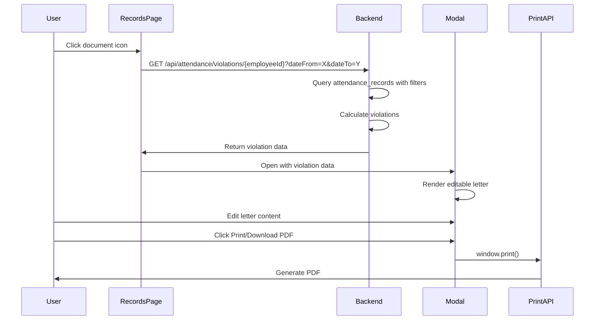

# Design Document: Attendance Violation Letter Generation

## Overview

This feature enables HR administrators to generate formal, editable warning letters for employees with attendance violations. The system integrates into the existing attendance records page, leveraging the document icon button in the Action column to trigger letter generation. The feature calculates violations from attendance records, presents an editable preview in a modal, and generates a print-ready PDF.

### Key Design Decisions

**PDF Generation Approach**: Client-side generation using react-to-print + browser print API
- Rationale: Simpler implementation, no server-side dependencies, instant preview
- The editable preview uses contentEditable divs styled for A4 format
- Browser's native print-to-PDF provides consistent, high-quality output
- Alternative considered: jsPDF (more complex, requires manual layout calculations)

**Editability Strategy**: ContentEditable with structured sections
- Each section (title, body paragraphs, violation lists) is independently editable
- Maintains professional formatting through CSS constraints
- Preserves structure while allowing text modifications

**Data Flow**: Frontend-driven with backend API for violation data
- Backend endpoint provides structured violation data filtered by date range
- Frontend handles letter composition, editing, and PDF generation
- Reduces server load and provides instant user feedback

## Architecture

### Component Structure

```
AttendanceRecords (existing)
  └─ ViolationLetterModal (new)
       ├─ LetterPreview (new)
       │    ├─ EditableSection (new)
       │    └─ ViolationBreakdown (new)
       └─ PrintButton (new)
```

### Data Flow



### Technology Stack

- **Frontend**: React 18+ with Inertia.js
- **Backend**: Laravel 10+ (PHP 8.1+)
- **PDF Generation**: react-to-print + browser print API
- **Styling**: Tailwind CSS with print-specific media queries
- **State Management**: React useState hooks

## Components and Interfaces

### Backend API Endpoint

**Route**: `GET /api/attendance/violations/{employeeId}`

**Query Parameters**:
- `dateFrom` (optional): Start date for violation calculation (YYYY-MM-DD)
- `dateTo` (optional): End date for violation calculation (YYYY-MM-DD)

**Response Structure**:
```json
{
  "employee": {
    "id": 123,
    "code": "EMP001",
    "name": "Juan Dela Cruz",
    "department": "IT Department"
  },
  "dateRange": {
    "start": "2024-01-01",
    "end": "2024-01-31",
    "startFormatted": "January 1, 2024",
    "endFormatted": "January 31, 2024"
  },
  "violations": {
    "absences": [
      {
        "date": "2024-01-05",
        "dateFormatted": "January 5, 2024",
        "status": "Absent"
      }
    ],
    "lateAM": [
      {
        "date": "2024-01-10",
        "dateFormatted": "January 10, 2024",
        "minutes": 15
      }
    ],
    "latePM": [
      {
        "date": "2024-01-12",
        "dateFormatted": "January 12, 2024",
        "minutes": 20
      }
    ],
    "missedLogs": [
      {
        "date": "2024-01-15",
        "dateFormatted": "January 15, 2024",
        "count": 2
      }
    ]
  },
  "summary": {
    "totalAbsences": 1,
    "totalLateAM": 1,
    "totalLatePM": 1,
    "totalMissedLogs": 1
  }
}
```

### Frontend Components

#### ViolationLetterModal Component

**Props**:
```typescript
interface ViolationLetterModalProps {
  isOpen: boolean;
  onClose: () => void;
  employeeId: number;
  dateFilters: {
    dateFrom: string | null;
    dateTo: string | null;
  };
}
```

**State**:
```typescript
interface ModalState {
  loading: boolean;
  violationData: ViolationData | null;
  error: string | null;
}
```

**Responsibilities**:
- Fetch violation data from backend
- Manage modal open/close state
- Coordinate between preview and print functionality
- Handle loading and error states

#### LetterPreview Component

**Props**:
```typescript
interface LetterPreviewProps {
  violationData: ViolationData;
  ref: React.RefObject; // For react-to-print
}
```

**Responsibilities**:
- Render letter with A4 dimensions (210mm × 297mm)
- Provide contentEditable sections for all text
- Apply print-specific CSS styling
- Maintain professional formatting during edits

#### EditableSection Component

**Props**:
```typescript
interface EditableSectionProps {
  content: string;
  onChange: (newContent: string) => void;
  className?: string;
  placeholder?: string;
}
```

**Responsibilities**:
- Render contentEditable div
- Handle text changes
- Preserve formatting
- Prevent line breaks where inappropriate

#### ViolationBreakdown Component

**Props**:
```typescript
interface ViolationBreakdownProps {
  violations: {
    absences: Absence[];
    lateAM: Late[];
    latePM: Late[];
    missedLogs: MissedLog[];
  };
  editable: boolean;
}
```

**Responsibilities**:
- Display structured violation lists
- Allow editing of dates and details
- Format violation entries consistently

## Data Models

### AttendanceRecord (existing)

```php
class AttendanceRecord extends Model
{
    protected $fillable = [
        'employee_id',
        'attendance_date',
        'schedule_id',
        'time_in_am',
        'time_out_lunch',
        'time_in_pm',
        'time_out_pm',
        'late_minutes_am',
        'late_minutes_pm',
        'overtime_minutes',
        'undertime_minutes',
        'rendered',
        'missed_logs_count',
        'status',
        'remarks',
    ];
}
```

### ViolationData (new, frontend)

```typescript
interface ViolationData {
  employee: {
    id: number;
    code: string;
    name: string;
    department: string;
  };
  dateRange: {
    start: string;
    end: string;
    startFormatted: string;
    endFormatted: string;
  };
  violations: {
    absences: Absence[];
    lateAM: Late[];
    latePM: Late[];
    missedLogs: MissedLog[];
  };
  summary: {
    totalAbsences: number;
    totalLateAM: number;
    totalLatePM: number;
    totalMissedLogs: number;
  };
}

interface Absence {
  date: string;
  dateFormatted: string;
  status: string;
}

interface Late {
  date: string;
  dateFormatted: string;
  minutes: number;
}

interface MissedLog {
  date: string;
  dateFormatted: string;
  count: number;
}
```

### Letter Template Structure

```typescript
interface LetterTemplate {
  title: string; // "MEMORANDUM"
  to: string; // Employee name and code
  from: string; // "Human Resources Department"
  date: string; // Current date
  subject: string; // "Attendance Violation Notice"
  body: {
    opening: string;
    dateRange: string;
    violationIntro: string;
    violationDetails: string; // Generated from violations
    actionRequired: string;
    deadline: string;
    closing: string;
  };
  signature: {
    line: string;
    name: string;
    title: string;
  };
}
```


## Correctness Properties

*A property is a characteristic or behavior that should hold true across all valid executions of a system—essentially, a formal statement about what the system should do. Properties serve as the bridge between human-readable specifications and machine-verifiable correctness guarantees.*


### Property Reflection

After analyzing all acceptance criteria, I identified the following redundancies:

**Redundancy Group 1: Violation Retrieval**
- Properties 1.1, 1.2, 1.3 all test violation retrieval with different filter states
- **Resolution**: Combine into single property that tests retrieval respects date filters (including null filters)

**Redundancy Group 2: Late AM/PM Recording and Listing**
- Properties 2.3 and 2.5 both test late AM instances (recording and listing)
- Properties 2.4 and 2.6 both test late PM instances (recording and listing)
- **Resolution**: Combine each pair into single properties (one for AM, one for PM)

**Redundancy Group 3: Missed Logs Recording and Listing**
- Properties 2.7 and 2.8 both test missed log instances
- **Resolution**: Combine into single property

**Redundancy Group 4: Editability**
- Properties 3.1, 3.2, 3.3, 3.4, 3.5 all test that different sections are editable
- **Resolution**: Keep 3.1 as general property, others are covered by it

**Redundancy Group 5: Date Filter Usage**
- Properties 1.1 and 7.2 both test that date filters are used correctly
- **Resolution**: 7.2 is redundant with 1.1

**Final Property Count**: Reduced from 40+ potential properties to 15 unique, non-redundant properties

### Property 1: Violation Retrieval Respects Date Filters

*For any* employee and any date range (including null/empty filters), when retrieving violations, the system should return only attendance records within the specified date range, or all records if no filters are active.

**Validates: Requirements 1.1, 1.2, 1.3, 7.2**

### Property 2: Letter Contains Employee Information

*For any* employee, the generated letter should contain their name, employee code, and department exactly as stored in the employee data.

**Validates: Requirements 1.5**

### Property 3: Letter Contains Date Range

*For any* date range used to calculate violations, that date range should appear in the generated letter in formatted form.

**Validates: Requirements 1.6**

### Property 4: Absence Count Matches Records

*For any* set of attendance records, the total absence count should equal the number of records where status indicates absence (including "Absent", "Half Day" statuses).

**Validates: Requirements 2.1**

### Property 5: All Absence Dates Listed

*For any* set of absence records, all absence dates should appear in the letter's violation breakdown section.

**Validates: Requirements 2.2**

### Property 6: Late AM Instances Captured Completely

*For any* set of attendance records, all records with late_minutes_am > 0 should appear in the letter's late AM section with their date and minutes.

**Validates: Requirements 2.3, 2.5**

### Property 7: Late PM Instances Captured Completely

*For any* set of attendance records, all records with late_minutes_pm > 0 should appear in the letter's late PM section with their date and minutes.

**Validates: Requirements 2.4, 2.6**

### Property 8: Missed Log Instances Captured Completely

*For any* set of attendance records, all records with missed_logs_count > 0 should appear in the letter's missed logs section with their date and count.

**Validates: Requirements 2.7, 2.8**

### Property 9: Layout Preservation During Editing

*For any* text input in any editable section, the document layout (margins, spacing, section structure) should remain unchanged after the edit.

**Validates: Requirements 3.6**

### Property 10: Formatting Preservation During Editing

*For any* text edit in the letter, the CSS classes and spacing properties should remain applied to maintain professional formatting.

**Validates: Requirements 3.7**

### Property 11: Print CSS Matches Preview CSS

*For any* letter content, the print media query CSS should preserve the same formatting, margins, and spacing as the screen preview.

**Validates: Requirements 5.3**

### Property 12: Print Output Contains Edited Content

*For any* edits made to the letter preview, the print output should contain exactly those edited values (round-trip property: edit → print → verify content matches edits).

**Validates: Requirements 5.4**

### Property 13: Modal Opens for Any Employee

*For any* employee in the attendance records table, clicking the document icon button should open the violation letter modal with that employee's data.

**Validates: Requirements 7.1**


## Error Handling

### Backend Error Scenarios

**1. Employee Not Found**
- **Scenario**: Request for violations with invalid employee ID
- **Response**: HTTP 404 with error message
- **Frontend Handling**: Display error modal with "Employee not found" message

**2. No Attendance Records**
- **Scenario**: Employee has no attendance records in the specified date range
- **Response**: HTTP 200 with empty violations array
- **Frontend Handling**: Display letter with "No violations found" message, allow admin to still generate letter with custom text

**3. Database Connection Error**
- **Scenario**: Database unavailable during violation query
- **Response**: HTTP 500 with generic error message
- **Frontend Handling**: Display error modal with retry option

**4. Invalid Date Range**
- **Scenario**: dateFrom is after dateTo
- **Response**: HTTP 422 with validation error
- **Frontend Handling**: Display validation error, prevent API call

### Frontend Error Scenarios

**1. Network Timeout**
- **Scenario**: API request takes longer than 30 seconds
- **Handling**: Show timeout message, provide retry button
- **User Action**: Retry request or close modal

**2. Print Dialog Cancelled**
- **Scenario**: User cancels browser print dialog
- **Handling**: Return to editable preview, no error message needed
- **User Action**: Can edit further or retry print

**3. Content Editing Errors**
- **Scenario**: User deletes all content from required section
- **Handling**: Show warning tooltip, prevent print until content restored
- **User Action**: Re-enter content or use reset button

**4. Modal State Errors**
- **Scenario**: Modal fails to open or close properly
- **Handling**: Log error to console, force modal state reset
- **User Action**: Refresh page if issue persists

### Validation Rules

**Date Range Validation**:
- dateFrom must be valid date format (YYYY-MM-DD)
- dateTo must be valid date format (YYYY-MM-DD)
- dateFrom must be <= dateTo
- Date range should not exceed 1 year (warning, not error)

**Content Validation**:
- Employee name cannot be empty
- At least one violation type must have data (or show "No violations" message)
- Signature section must contain text

### Error Recovery Strategies

**Graceful Degradation**:
- If violation data is incomplete, show partial letter with available data
- If formatting fails, fall back to plain text with basic structure
- If print fails, offer download as HTML option

**User Feedback**:
- Loading states during API calls (spinner with "Loading violations..." text)
- Success confirmation after PDF generation ("Letter generated successfully")
- Clear error messages with actionable next steps

## Testing Strategy

### Dual Testing Approach

This feature requires both unit tests and property-based tests for comprehensive coverage:

**Unit Tests** focus on:
- Specific examples of violation calculations
- Edge cases (empty violations, single violation, maximum violations)
- UI component rendering with sample data
- Error handling scenarios
- Integration between modal and parent page

**Property-Based Tests** focus on:
- Universal properties that hold for all inputs
- Violation retrieval across random date ranges and employee data
- Content preservation during editing and printing
- Layout and formatting consistency

Both testing approaches are complementary and necessary. Unit tests catch concrete bugs in specific scenarios, while property tests verify general correctness across all possible inputs.

### Property-Based Testing Configuration

**Library**: fast-check (JavaScript/TypeScript property-based testing library)
- Mature, well-maintained library for React/TypeScript projects
- Integrates with Jest/Vitest test runners
- Provides rich set of generators for complex data structures

**Test Configuration**:
- Minimum 100 iterations per property test (due to randomization)
- Each property test must include a comment tag referencing the design property
- Tag format: `// Feature: attendance-violation-letter, Property {number}: {property_text}`

**Example Property Test Structure**:
```typescript
// Feature: attendance-violation-letter, Property 1: Violation Retrieval Respects Date Filters
test('violation retrieval respects date filters', () => {
  fc.assert(
    fc.property(
      fc.record({
        employeeId: fc.integer({ min: 1, max: 1000 }),
        dateFrom: fc.option(fc.date(), { nil: null }),
        dateTo: fc.option(fc.date(), { nil: null }),
        records: fc.array(attendanceRecordArbitrary)
      }),
      async ({ employeeId, dateFrom, dateTo, records }) => {
        // Test implementation
      }
    ),
    { numRuns: 100 }
  );
});
```

### Unit Test Coverage

**Backend Tests** (PHPUnit):
1. ViolationController returns correct data structure
2. Violation calculation handles absent status correctly
3. Late minutes filtering works for AM and PM
4. Missed logs are counted correctly
5. Date range filtering excludes out-of-range records
6. Empty result set returns valid empty structure
7. Invalid employee ID returns 404
8. Invalid date range returns 422

**Frontend Tests** (Jest/Vitest + React Testing Library):
1. Modal opens when document icon clicked
2. Modal displays loading state during API call
3. Modal displays error state on API failure
4. Letter preview renders with violation data
5. All sections are contentEditable
6. Editing updates internal state
7. Print button triggers window.print()
8. Modal closes and returns to records page
9. Date filters are passed to API correctly
10. Empty violations show appropriate message

### Property-Based Test Coverage

**Property Tests** (fast-check):
1. Property 1: Violation retrieval respects date filters
2. Property 2: Letter contains employee information
3. Property 3: Letter contains date range
4. Property 4: Absence count matches records
5. Property 5: All absence dates listed
6. Property 6: Late AM instances captured completely
7. Property 7: Late PM instances captured completely
8. Property 8: Missed log instances captured completely
9. Property 9: Layout preservation during editing
10. Property 10: Formatting preservation during editing
11. Property 11: Print CSS matches preview CSS
12. Property 12: Print output contains edited content
13. Property 13: Modal opens for any employee

### Integration Testing

**End-to-End Tests** (Playwright/Cypress):
1. Complete flow: Click button → View letter → Edit → Print
2. Date filter integration with violation calculation
3. Multiple employees in sequence
4. Browser print dialog interaction
5. Modal state management across interactions

### Test Data Generators

**Arbitrary Generators for Property Tests**:
```typescript
// Generate random attendance records
const attendanceRecordArbitrary = fc.record({
  id: fc.integer({ min: 1 }),
  employee_id: fc.integer({ min: 1, max: 100 }),
  attendance_date: fc.date({ min: new Date('2024-01-01'), max: new Date('2024-12-31') }),
  status: fc.oneof(
    fc.constant('Present'),
    fc.constant('Absent'),
    fc.constant('Half Day'),
    fc.constant('Late')
  ),
  late_minutes_am: fc.integer({ min: 0, max: 120 }),
  late_minutes_pm: fc.integer({ min: 0, max: 120 }),
  missed_logs_count: fc.integer({ min: 0, max: 4 })
});

// Generate random employee data
const employeeArbitrary = fc.record({
  id: fc.integer({ min: 1, max: 1000 }),
  code: fc.string({ minLength: 6, maxLength: 10 }).map(s => 'EMP' + s),
  name: fc.string({ minLength: 5, maxLength: 50 }),
  department: fc.oneof(
    fc.constant('IT Department'),
    fc.constant('HR Department'),
    fc.constant('Finance Department'),
    fc.constant('Operations')
  )
});

// Generate random date ranges
const dateRangeArbitrary = fc.record({
  start: fc.date({ min: new Date('2024-01-01'), max: new Date('2024-12-31') }),
  end: fc.date({ min: new Date('2024-01-01'), max: new Date('2024-12-31') })
}).filter(({ start, end }) => start <= end);
```

### Manual Testing Checklist

- [ ] Letter displays correctly for employee with no violations
- [ ] Letter displays correctly for employee with all violation types
- [ ] Letter displays correctly for employee with only one violation type
- [ ] Date filters correctly limit violations shown
- [ ] Editing title updates preview
- [ ] Editing body text updates preview
- [ ] Editing violation details updates preview
- [ ] Print preview matches screen preview
- [ ] PDF output matches edited content
- [ ] Modal closes without errors
- [ ] Multiple letters can be generated in sequence
- [ ] Browser print dialog appears with correct content
- [ ] A4 page size is respected in print output
- [ ] Margins are appropriate for printing
- [ ] Text doesn't overflow page boundaries

## Implementation Notes

### CSS Print Styling

```css
@media print {
  @page {
    size: A4;
    margin: 20mm;
  }
  
  .letter-preview {
    width: 210mm;
    min-height: 297mm;
    padding: 20mm;
    background: white;
    font-size: 12pt;
    line-height: 1.6;
  }
  
  .no-print {
    display: none !important;
  }
  
  .page-break {
    page-break-after: always;
  }
}
```

### ContentEditable Implementation

```typescript
const EditableSection: React.FC<EditableSectionProps> = ({ 
  content, 
  onChange, 
  className 
}) => {
  const handleInput = (e: React.FormEvent<HTMLDivElement>) => {
    onChange(e.currentTarget.textContent || '');
  };

  return (
    <div
      contentEditable
      suppressContentEditableWarning
      onInput={handleInput}
      className={className}
      dangerouslySetInnerHTML={{ __html: content }}
    />
  );
};
```

### React-to-Print Integration

```typescript
import { useReactToPrint } from 'react-to-print';

const ViolationLetterModal: React.FC<Props> = ({ ... }) => {
  const letterRef = useRef<HTMLDivElement>(null);
  
  const handlePrint = useReactToPrint({
    content: () => letterRef.current,
    documentTitle: `Violation_Letter_${employee.code}_${new Date().toISOString().split('T')[0]}`,
    pageStyle: `
      @page {
        size: A4;
        margin: 20mm;
      }
    `
  });

  return (
    <div>
      <LetterPreview ref={letterRef} data={violationData} />
      <button onClick={handlePrint}>Print/Download PDF</button>
    </div>
  );
};
```

### Backend Controller Method

```php
public function getViolations(Request $request, int $employeeId)
{
    $request->validate([
        'dateFrom' => 'nullable|date',
        'dateTo' => 'nullable|date|after_or_equal:dateFrom',
    ]);

    $employee = Employee::with('department')->findOrFail($employeeId);
    
    $query = AttendanceRecord::where('employee_id', $employeeId);
    
    if ($request->dateFrom) {
        $query->where('attendance_date', '>=', $request->dateFrom);
    }
    
    if ($request->dateTo) {
        $query->where('attendance_date', '<=', $request->dateTo);
    }
    
    $records = $query->orderBy('attendance_date')->get();
    
    return response()->json([
        'employee' => [
            'id' => $employee->id,
            'code' => $employee->employee_code,
            'name' => $employee->first_name . ' ' . $employee->last_name,
            'department' => $employee->department->name,
        ],
        'dateRange' => [
            'start' => $request->dateFrom ?? $records->min('attendance_date'),
            'end' => $request->dateTo ?? $records->max('attendance_date'),
            'startFormatted' => Carbon::parse($request->dateFrom ?? $records->min('attendance_date'))->format('F j, Y'),
            'endFormatted' => Carbon::parse($request->dateTo ?? $records->max('attendance_date'))->format('F j, Y'),
        ],
        'violations' => $this->calculateViolations($records),
        'summary' => $this->calculateSummary($records),
    ]);
}
```

### Performance Considerations

**Database Query Optimization**:
- Index on `attendance_records.employee_id` and `attendance_records.attendance_date`
- Eager load employee and department relationships
- Limit query to necessary columns

**Frontend Optimization**:
- Lazy load modal component (code splitting)
- Debounce contentEditable onChange handlers
- Memoize violation calculations
- Use React.memo for static sections

**Print Performance**:
- Pre-render print styles
- Minimize DOM complexity in printable area
- Use CSS transforms instead of JavaScript for layout

## Security Considerations

**Authorization**:
- Verify admin has permission to view employee attendance data
- Implement role-based access control (RBAC)
- Log all letter generation attempts for audit trail

**Data Privacy**:
- Ensure violation data is only accessible to authorized users
- Don't expose sensitive employee data in API responses
- Sanitize all user-edited content before printing

**Input Validation**:
- Validate employee ID to prevent SQL injection
- Validate date formats to prevent malformed queries
- Sanitize contentEditable input to prevent XSS

**Rate Limiting**:
- Limit API requests to prevent abuse
- Implement per-user rate limits for letter generation
- Monitor for unusual access patterns

## Future Enhancements

**Phase 2 Considerations**:
- Email letter directly to employee
- Save letter templates for reuse
- Batch letter generation for multiple employees
- Digital signature integration
- Letter history and versioning
- Custom letter templates per department
- Automated letter generation based on violation thresholds
- Multi-language support for letter content
