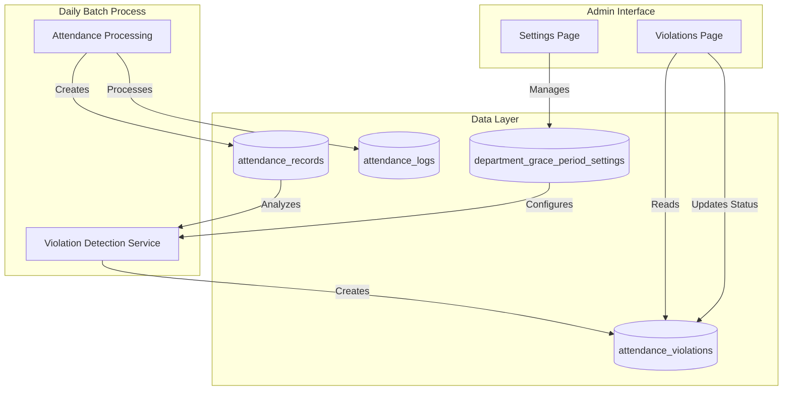
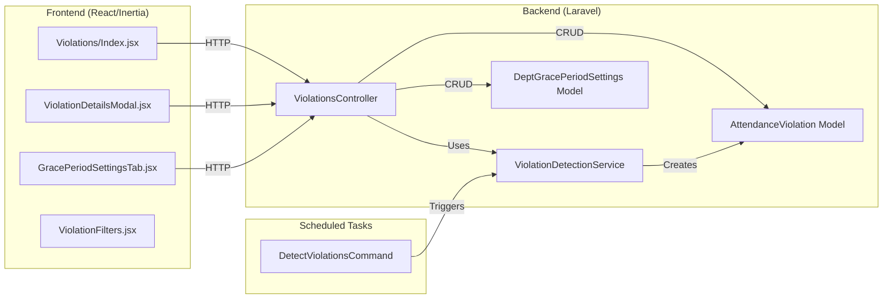

# Design Document: Attendance Violations Page

## Overview

The Attendance Violations Page is an admin-only feature that provides centralized monitoring and management of employee attendance policy violations. The system automatically detects nine types of violations through a daily batch process that analyzes attendance records after daily processing completes.

### Key Features

- Automated violation detection for 9 violation types
- Per-department grace period configuration with monthly tracking
- Comprehensive filtering, search, and pagination
- Detailed violation information with contextual metadata
- Status tracking workflow (Pending → Reviewed → Letter Sent)
- CSV export for reporting and analysis
- Print functionality for violation notices
- Integration with existing attendance processing pipeline

### Violation Types

1. **Cumulative Grace Period Exceeded** - Employee exceeds monthly late time allowance (default: 60 minutes)
2. **Unexcused Absence** - Employee absent without approved leave
3. **AWOL** - Three consecutive unexcused absences (critical severity)
4. **Biometrics Policy Violation** - Missing required biometric timestamps
5. **Missing Logs** - Pattern of incomplete attendance logs (3+ occurrences in 30 days)
6. **Excessive Logs** - More than 4 logs in a single day
7. **Unauthorized Work** - Working on non-scheduled days without approval
8. **Excessive Undertime** - Pattern of early departures (5+ occurrences in 30 days)
9. **Frequent Half Day** - Pattern of half-day attendance (4+ occurrences in 30 days)

### Design Principles

- **Separation of Concerns**: Detection logic isolated in service layer, UI in React components
- **Existing Patterns**: Follow Laravel conventions (Controllers, Services, Models, Repositories)
- **Data Integrity**: All violation detection based on existing attendance_records table
- **Performance**: Batch processing runs daily, not real-time
- **Extensibility**: Easy to add new violation types through service configuration

## Architecture

### System Context



### Component Architecture



### Data Flow

**Violation Detection Flow:**
1. Daily attendance processing completes (existing system)
2. Scheduled command triggers ViolationDetectionService
3. Service queries attendance_records for each employee
4. Service applies detection rules for each violation type
5. Service checks department grace period settings
6. Service creates/updates attendance_violations records
7. Admin views violations in UI

**Grace Period Configuration Flow:**
1. Admin navigates to Settings → Grace Period tab
2. Admin selects department
3. Admin configures tracking period, limit, and enabled status
4. System saves to department_grace_period_settings table
5. Future violation detection uses new settings

## Components and Interfaces

### Backend Components

#### 1. ViolationDetectionService

**Responsibility**: Analyze attendance records and detect policy violations

**Public Methods**:

```php
class ViolationDetectionService
{
    /**
     * Run violation detection for all employees for a specific date
     * Called by daily scheduled command
     */
    public function detectViolationsForDate(Carbon $date): array;
    
    /**
     * Run violation detection for a specific employee and date range
     * Used for manual reprocessing or testing
     */
    public function detectViolationsForEmployee(
        int $employeeId, 
        Carbon $startDate, 
        Carbon $endDate
    ): array;
    
    /**
     * Detect cumulative grace period violations for an employee
     */
    protected function detectCumulativeGracePeriodViolation(
        Employee $employee, 
        Carbon $date
    ): ?array;
    
    /**
     * Detect unexcused absence violations
     */
    protected function detectUnexcusedAbsence(
        Employee $employee, 
        Carbon $date
    ): ?array;
    
    /**
     * Detect AWOL (3 consecutive absences)
     */
    protected function detectAWOL(
        Employee $employee, 
        Carbon $date
    ): ?array;
    
    /**
     * Detect biometrics policy violations (missing timestamps)
     */
    protected function detectBiometricsViolation(
        Employee $employee, 
        Carbon $date
    ): ?array;
    
    /**
     * Detect missing logs pattern (3+ occurrences in 30 days)
     */
    protected function detectMissingLogsPattern(
        Employee $employee, 
        Carbon $date
    ): ?array;
    
    /**
     * Detect excessive logs (>4 logs in a day)
     */
    protected function detectExcessiveLogs(
        Employee $employee, 
        Carbon $date
    ): ?array;
    
    /**
     * Detect unauthorized work pattern
     */
    protected function detectUnauthorizedWork(
        Employee $employee, 
        Carbon $date
    ): ?array;
    
    /**
     * Detect excessive undertime pattern (5+ in 30 days)
     */
    protected function detectExcessiveUndertime(
        Employee $employee, 
        Carbon $date
    ): ?array;
    
    /**
     * Detect frequent half-day pattern (4+ in 30 days)
     */
    protected function detectFrequentHalfDay(
        Employee $employee, 
        Carbon $date
    ): ?array;
    
    /**
     * Get grace period settings for a department
     */
    protected function getGracePeriodSettings(int $departmentId): object;
    
    /**
     * Calculate tracking period date range based on settings
     */
    protected function getTrackingPeriodRange(
        Carbon $date, 
        string $trackingPeriod, 
        ?object $payPeriodConfig
    ): array;
}
```

**Dependencies**:
- AttendanceRecord model
- AttendanceLog model
- Employee model
- AttendanceViolation model
- DepartmentGracePeriodSettings model

#### 2. AttendanceViolation Model

**Responsibility**: Represent violation records in database

```php
class AttendanceViolation extends Model
{
    protected $fillable = [
        'employee_id',
        'violation_date',
        'violation_type',
        'details',
        'severity',
        'status',
        'metadata',
        'notes',
        'dismissed_at',
        'dismissed_by',
    ];
    
    protected $casts = [
        'violation_date' => 'date',
        'metadata' => 'array',
        'dismissed_at' => 'datetime',
    ];
    
    // Relationships
    public function employee(): BelongsTo;
    public function dismissedBy(): BelongsTo; // User who dismissed the violation
    
    // Scopes
    public function scopeByType(Builder $query, string $type): Builder;
    public function scopeBySeverity(Builder $query, string $severity): Builder;
    public function scopeByStatus(Builder $query, string $status): Builder;
    public function scopeDateRange(Builder $query, Carbon $start, Carbon $end): Builder;
    public function scopeSearch(Builder $query, string $search): Builder;
    public function scopeActive(Builder $query): Builder; // Exclude dismissed violations
    public function scopeDismissed(Builder $query): Builder; // Only dismissed violations
    
    // Methods
    public function dismiss(int $userId): bool; // Soft delete with user tracking
}
```

#### 3. DepartmentGracePeriodSettings Model

**Responsibility**: Store per-department grace period configuration

```php
class DepartmentGracePeriodSettings extends Model
{
    protected $fillable = [
        'department_id',
        'cumulative_tracking_enabled',
        'grace_period_limit_minutes',
        'tracking_period', // 'monthly', 'pay_period', 'rolling_30'
        'pay_period_start_day',
        'pay_period_frequency', // 'weekly', 'bi-weekly', 'semi-monthly', 'monthly'
    ];
    
    protected $casts = [
        'cumulative_tracking_enabled' => 'boolean',
        'grace_period_limit_minutes' => 'integer',
        'pay_period_start_day' => 'integer',
    ];
    
    // Relationships
    public function department(): BelongsTo;
    
    // Default values
    public const DEFAULT_GRACE_PERIOD_MINUTES = 60;
    public const DEFAULT_TRACKING_PERIOD = 'monthly';
    public const DEFAULT_CUMULATIVE_ENABLED = false;
}
```

#### 4. ViolationsController

**Responsibility**: Handle HTTP requests for violations management

```php
class ViolationsController extends Controller
{
    /**
     * Display violations list with filters
     * By default, excludes dismissed violations
     * Optional 'show_dismissed' filter to include dismissed violations
     */
    public function index(Request $request): Response;
    
    /**
     * Get violation details
     */
    public function show(int $id): Response;
    
    /**
     * Update violation status
     */
    public function updateStatus(Request $request, int $id): RedirectResponse;
    
    /**
     * Update violation notes
     */
    public function updateNotes(Request $request, int $id): JsonResponse;
    
    /**
     * Dismiss a violation
     */
    public function dismissViolation(Request $request, int $id): JsonResponse;
    
    /**
     * Export violations to CSV
     */
    public function export(Request $request): BinaryFileResponse;
    
    /**
     * Get printable violation notice
     */
    public function print(int $id): Response;
    
    /**
     * Bulk print multiple violations
     */
    public function bulkPrint(Request $request): Response;
    
    /**
     * Get grace period settings for a department
     */
    public function getGracePeriodSettings(int $departmentId): JsonResponse;
    
    /**
     * Update grace period settings for a department
     */
    public function updateGracePeriodSettings(
        Request $request, 
        int $departmentId
    ): JsonResponse;
}
```

#### 5. DetectViolationsCommand

**Responsibility**: Scheduled command to run daily violation detection

```php
class DetectViolationsCommand extends Command
{
    protected $signature = 'attendance:detect-violations {--date=}';
    protected $description = 'Detect attendance violations for a specific date';
    
    public function handle(ViolationDetectionService $service): int;
}
```

### Frontend Components

#### 1. Violations/Index.jsx

**Responsibility**: Main violations list page with filters and actions

**Props**:
```typescript
interface Props {
    violations: PaginatedData<Violation>;
    filters: ViolationFilters;
    departments: Department[];
}

interface Violation {
    id: number;
    employee: {
        id: number;
        employee_code: string;
        first_name: string;
        last_name: string;
    };
    violation_date: string;
    violation_type: string;
    severity: 'Low' | 'Medium' | 'High' | 'Critical';
    status: 'Pending' | 'Reviewed' | 'Letter Sent';
    details: string;
    metadata: Record<string, any>;
}
```

**Features**:
- Violations table with sorting
- Filter controls (employee, type, severity, status, date range)
- Search input
- Pagination controls
- Export to CSV button
- Bulk select and print
- Color-coded severity indicators

#### 2. ViolationDetailsModal.jsx

**Responsibility**: Display detailed violation information and allow status updates

**Props**:
```typescript
interface Props {
    violation: Violation;
    isOpen: boolean;
    onClose: () => void;
    onStatusUpdate: (id: number, status: string) => void;
    onNotesUpdate: (id: number, notes: string) => void;
    onDismiss: (id: number) => void;
}

interface Violation {
    id: number;
    employee: {
        id: number;
        employee_code: string;
        first_name: string;
        last_name: string;
    };
    violation_date: string;
    violation_type: string;
    severity: 'Low' | 'Medium' | 'High' | 'Critical';
    status: 'Pending' | 'Reviewed' | 'Letter Sent';
    details: string;
    metadata: Record<string, any>;
    notes: string | null;
    dismissed_at: string | null;
    dismissed_by: number | null;
}
```

**Features**:
- Employee information display
- Violation details with formatted metadata
- Status dropdown with update functionality
- Notes text area with save button (max 2000 characters)
- Dismiss button with confirmation dialog
- Print button for single violation notice
- Contextual information based on violation type
- Display dismissed status if applicable

#### 3. Settings/Tabs/GracePeriodSettingsTab.jsx

**Responsibility**: Configure grace period policies per department

**Props**:
```typescript
interface Props {
    departments: Department[];
    settings: Record<number, GracePeriodSettings>;
}

interface GracePeriodSettings {
    department_id: number;
    cumulative_tracking_enabled: boolean;
    grace_period_limit_minutes: number;
    tracking_period: 'monthly' | 'pay_period' | 'rolling_30';
    pay_period_start_day?: number;
    pay_period_frequency?: 'weekly' | 'bi-weekly' | 'semi-monthly' | 'monthly';
}
```

**Features**:
- Department selector
- Toggle for cumulative tracking
- Input for grace period limit (1-480 minutes)
- Dropdown for tracking period
- Conditional pay period configuration fields
- Save button with validation
- Informational notes about monthly tracking

#### 4. ViolationFilters.jsx

**Responsibility**: Reusable filter component

**Props**:
```typescript
interface Props {
    filters: ViolationFilters;
    onFilterChange: (filters: ViolationFilters) => void;
    departments: Department[];
}

interface ViolationFilters {
    employee_name?: string;
    violation_type?: string;
    severity?: string;
    status?: string;
    start_date?: string;
    end_date?: string;
    department_id?: number;
}
```

## Data Models

### Database Schema

#### attendance_violations (existing, updated)

```sql
CREATE TABLE attendance_violations (
    id BIGINT UNSIGNED PRIMARY KEY AUTO_INCREMENT,
    employee_id BIGINT UNSIGNED NOT NULL,
    violation_date DATE NOT NULL,
    violation_type VARCHAR(255) NOT NULL,
    details TEXT NULL,
    severity ENUM('Low', 'Medium', 'High', 'Critical') DEFAULT 'Medium',
    status ENUM('Pending', 'Reviewed', 'Letter Sent') DEFAULT 'Pending',
    metadata JSON NULL,
    notes TEXT NULL,
    dismissed_at TIMESTAMP NULL,
    dismissed_by BIGINT UNSIGNED NULL,
    created_at TIMESTAMP NULL,
    updated_at TIMESTAMP NULL,
    
    FOREIGN KEY (employee_id) REFERENCES employees(id) ON DELETE CASCADE,
    FOREIGN KEY (dismissed_by) REFERENCES users(id) ON DELETE SET NULL,
    INDEX idx_employee_date (employee_id, violation_date),
    INDEX idx_status (status),
    INDEX idx_type (violation_type),
    INDEX idx_dismissed_at (dismissed_at)
);
```

#### department_grace_period_settings (new)

```sql
CREATE TABLE department_grace_period_settings (
    id BIGINT UNSIGNED PRIMARY KEY AUTO_INCREMENT,
    department_id BIGINT UNSIGNED NOT NULL UNIQUE,
    cumulative_tracking_enabled BOOLEAN DEFAULT FALSE,
    grace_period_limit_minutes INT DEFAULT 60,
    tracking_period ENUM('monthly', 'pay_period', 'rolling_30') DEFAULT 'monthly',
    pay_period_start_day INT NULL,
    pay_period_frequency ENUM('weekly', 'bi-weekly', 'semi-monthly', 'monthly') NULL,
    created_at TIMESTAMP NULL,
    updated_at TIMESTAMP NULL,
    
    FOREIGN KEY (department_id) REFERENCES departments(id) ON DELETE CASCADE
);
```

### Metadata Structure by Violation Type

#### Cumulative Grace Period Exceeded
```json
{
    "total_late_minutes": 85,
    "grace_period_used": 85,
    "grace_period_limit": 60,
    "deductible_minutes": 25,
    "tracking_period": "monthly",
    "tracking_start": "2026-02-01",
    "tracking_end": "2026-02-28",
    "affected_dates": [
        {"date": "2026-02-03", "late_am": 15, "late_pm": 0},
        {"date": "2026-02-05", "late_am": 20, "late_pm": 10},
        {"date": "2026-02-10", "late_am": 0, "late_pm": 25},
        {"date": "2026-02-15", "late_am": 15, "late_pm": 0}
    ]
}
```

#### AWOL
```json
{
    "consecutive_dates": ["2026-02-10", "2026-02-11", "2026-02-12"],
    "absence_count": 3
}
```

#### Biometrics Policy Violation
```json
{
    "missing_timestamps": ["time_in_am", "time_out_pm"],
    "has_time_in_am": false,
    "has_time_out_lunch": true,
    "has_time_in_pm": true,
    "has_time_out_pm": false
}
```

#### Missing Logs
```json
{
    "occurrences_count": 5,
    "total_missed_logs": 8,
    "date_range": {"start": "2026-02-01", "end": "2026-02-28"},
    "affected_dates": [
        {"date": "2026-02-03", "missed_count": 2},
        {"date": "2026-02-10", "missed_count": 1},
        {"date": "2026-02-15", "missed_count": 3},
        {"date": "2026-02-20", "missed_count": 1},
        {"date": "2026-02-25", "missed_count": 1}
    ]
}
```

#### Excessive Logs
```json
{
    "log_count": 7,
    "log_timestamps": [
        "08:05:23", "08:06:12", "12:00:45", 
        "13:05:12", "13:06:01", "17:00:23", "17:01:45"
    ],
    "expected_count": 4
}
```

#### Unauthorized Work
```json
{
    "occurrences_count": 3,
    "date_range": {"start": "2026-02-01", "end": "2026-02-28"},
    "unauthorized_dates": ["2026-02-08", "2026-02-15", "2026-02-22"],
    "day_of_week": "Sunday"
}
```

#### Excessive Undertime
```json
{
    "occurrences_count": 6,
    "total_undertime_minutes": 195,
    "date_range": {"start": "2026-02-01", "end": "2026-02-28"},
    "affected_dates": [
        {"date": "2026-02-03", "undertime_minutes": 30},
        {"date": "2026-02-05", "undertime_minutes": 45},
        {"date": "2026-02-10", "undertime_minutes": 25},
        {"date": "2026-02-15", "undertime_minutes": 35},
        {"date": "2026-02-20", "undertime_minutes": 30},
        {"date": "2026-02-25", "undertime_minutes": 30}
    ]
}
```

#### Frequent Half Day
```json
{
    "occurrences_count": 5,
    "date_range": {"start": "2026-02-01", "end": "2026-02-28"},
    "half_day_dates": [
        "2026-02-03", "2026-02-10", "2026-02-15", 
        "2026-02-20", "2026-02-25"
    ]
}
```

## Correctness Properties

*A property is a characteristic or behavior that should hold true across all valid executions of a system—essentially, a formal statement about what the system should do. Properties serve as the bridge between human-readable specifications and machine-verifiable correctness guarantees.*

Before defining the correctness properties, I need to analyze the acceptance criteria to determine which are testable as properties, examples, or edge cases.


### Property Reflection

After analyzing all acceptance criteria, I've identified the following areas of redundancy:

**Redundancy Group 1: Violation Creation**
- Multiple properties test "when condition X, create violation" for each violation type
- These can be consolidated into type-specific properties that cover the detection logic

**Redundancy Group 2: Severity Assignment**
- Multiple properties test "violation type X should have severity Y"
- These can be combined into a single property about severity mapping

**Redundancy Group 3: Metadata Requirements**
- Multiple properties test "violation should have metadata fields X, Y, Z"
- These can be combined into type-specific metadata validation properties

**Redundancy Group 4: Department Settings**
- Properties 5.3, 5.4, 5.5 all test department configuration usage
- These can be combined into one comprehensive property about configuration resolution

**Redundancy Group 5: UI Field Display**
- Multiple properties test "modal/page should display fields X, Y, Z"
- These can be combined into properties about required field presence

**Redundancy Group 6: Filter Round-Trip**
- Properties about applying and clearing filters (2.6, 2.7, 16.5)
- These test the same pattern and can be consolidated

After reflection, I've eliminated redundant properties and consolidated related tests into comprehensive properties that provide unique validation value.

### Property 1: Violation List Display Completeness

*For any* violation record retrieved from the database, the violations page display should include employee name, violation date, violation type, severity level, and status.

**Validates: Requirements 1.2**

### Property 2: Default Sort Order

*For any* set of violation records, when displayed without explicit sort criteria, the violations should be ordered by violation_date in descending order (newest first).

**Validates: Requirements 1.3**

### Property 3: Severity Visual Indicator Mapping

*For any* violation record, the visual indicator displayed should correspond to its severity level: Critical → dark red, High → red, Medium → yellow, Low → blue.

**Validates: Requirements 1.4, 1.5, 1.6, 1.7**

### Property 4: Filter Conjunction

*For any* set of filter criteria (employee name, violation type, severity, status, date range), the filtered results should contain only violations that match ALL selected criteria simultaneously.

**Validates: Requirements 2.6**

### Property 5: Filter Clear Round-Trip

*For any* set of violations and any applied filters, clearing all filters should restore the display to show all violations (matching the pre-filtered state).

**Validates: Requirements 2.7, 16.5**

### Property 6: Status Update Persistence

*For any* violation record and any valid status value (Pending, Reviewed, Letter Sent), updating the status should persist the new value to the database and subsequent reads should reflect the updated status.

**Validates: Requirements 4.3, 4.6**

### Property 7: Cumulative Grace Period Threshold Detection

*For any* employee in a department with cumulative tracking enabled, when the sum of late_minutes_am and late_minutes_pm within the tracking period reaches or exceeds the configured grace period limit, a violation record with type "Cumulative Grace Period Exceeded" should be created on the day the threshold is crossed.

**Validates: Requirements 5.2**

### Property 8: Department Configuration Resolution

*For any* employee, the violation detection system should use grace period settings in this priority order: (1) employee's department-specific configuration if it exists, (2) system default settings (cumulative tracking disabled, 60-minute limit, monthly tracking) if no department configuration exists.

**Validates: Requirements 5.3, 5.4, 5.5, 18.11**

### Property 9: Tracking Period Date Range Calculation

*For any* date and tracking period type (monthly, pay_period, rolling_30), the system should calculate the correct date range: monthly → calendar month boundaries, pay_period → based on configured start day and frequency, rolling_30 → 30 days prior to current date.

**Validates: Requirements 5.6, 5.7, 5.8**

### Property 10: Late Minutes Summation

*For any* employee and tracking period, the total late minutes should equal the sum of (late_minutes_am + late_minutes_pm) from all attendance records within the tracking period where either value is greater than 0.

**Validates: Requirements 5.11**

### Property 11: Grace Period Deduction Calculation

*For any* employee with total late minutes exceeding the grace period limit, the deductible minutes should equal (total late minutes - grace period limit), and only minutes exceeding the threshold should be subject to salary deduction.

**Validates: Requirements 5.12, 5.13, 5.15, 5.16, 5.17**

### Property 12: Cumulative Violation Metadata Completeness

*For any* cumulative grace period exceeded violation, the metadata should contain: total_late_minutes, grace_period_used, grace_period_limit, deductible_minutes, tracking_period, tracking_start, tracking_end, and affected_dates array with date and late minute breakdown.

**Validates: Requirements 5.10, 5.12, 5.13**

### Property 13: Unexcused Absence Detection

*For any* attendance record with status "Absent" (not "Absent - Excused"), a violation record with type "Unexcused Absence" and severity "High" should be created.

**Validates: Requirements 6.1, 6.2, 6.5**

### Property 14: AWOL Consecutive Detection

*For any* employee with 3 consecutive attendance records having status "Absent" (excluding weekends and holidays based on employee schedule), a violation record with type "AWOL" and severity "Critical" should be created, with metadata containing the three consecutive absence dates.

**Validates: Requirements 7.1, 7.2, 7.3, 7.4, 7.5**

### Property 15: Biometrics Policy Violation Detection

*For any* attendance record where time_in_am is null OR time_out_pm is null, a violation record with type "Biometrics Policy Violation" should be created, with severity "High" if both are null, otherwise "Medium".

**Validates: Requirements 8.1, 8.2, 8.3, 8.4, 8.5**

### Property 16: Missing Logs Pattern Detection

*For any* employee with 3 or more attendance records having missed_logs_count > 0 within a 30-day period, a violation record with type "Missing Logs" should be created, with severity based on total missed logs: High (>10), Medium (5-10), Low (<5).

**Validates: Requirements 9.1, 9.2, 9.3, 9.4, 9.5, 9.6, 9.7**

### Property 17: Excessive Logs Detection

*For any* employee with more than 4 attendance log entries in the attendance_logs table for a specific date, a violation record with type "Excessive Logs" should be created, with severity High (>6 logs) or Medium (5-6 logs), and metadata containing log count and all timestamps.

**Validates: Requirements 10.1, 10.2, 10.3, 10.4, 10.5, 10.6**

### Property 18: Unauthorized Work Pattern Detection

*For any* employee with attendance records having status "Present - Unauthorized Work Day", a violation record with type "Unauthorized Work" should be created, with severity High (3+ occurrences in 30 days) or Medium (1-2 occurrences in 30 days).

**Validates: Requirements 11.1, 11.2, 11.3, 11.4**

### Property 19: Excessive Undertime Pattern Detection

*For any* employee with 5 or more attendance records having undertime_minutes > 0 within a 30-day period, a violation record with type "Excessive Undertime" should be created, with severity based on total undertime: High (>180 min), Medium (90-180 min), Low (<90 min).

**Validates: Requirements 12.1, 12.2, 12.3, 12.4, 12.5**

### Property 20: Frequent Half Day Pattern Detection

*For any* employee with 4 or more attendance records having status "Half Day" within a 30-day period, a violation record with type "Frequent Half Day" should be created, with severity High (6+ occurrences) or Medium (4-5 occurrences).

**Validates: Requirements 13.1, 13.2, 13.3, 13.4**

### Property 21: Pagination Consistency

*For any* set of violations with count > 25, the paginated display should show exactly 25 records per page (except the last page), and navigating through all pages should present each violation exactly once.

**Validates: Requirements 14.1, 14.2, 14.3, 14.4**

### Property 22: Filter Application Resets Pagination

*For any* current page number > 1, applying or changing any filter criteria should reset the pagination to page 1.

**Validates: Requirements 14.5**

### Property 23: CSV Export Column Completeness

*For any* exported CSV file, it should contain columns for: employee name, employee ID, violation date, violation type, severity, status, details, and notes.

**Validates: Requirements 15.3, 17.3**

### Property 24: CSV Export Filter Consistency

*For any* set of active filters, the exported CSV should contain exactly the same violation records that are displayed in the filtered view (across all pages).

**Validates: Requirements 15.4**

### Property 25: Search Text Matching

*For any* search text input, the filtered results should include only violations where the employee name contains the search text OR the details field contains the search text (case-insensitive).

**Validates: Requirements 16.3**

### Property 26: Print Notice Field Completeness

*For any* violation record, the generated printable notice should include: employee name, employee ID, violation type, violation date, severity level, detailed description, notes (if present), and a note about verifying logs in the Lilo system.

**Validates: Requirements 17.3, 17.4, 19.4**

### Property 27: Grace Period Settings Persistence

*For any* department and any valid grace period configuration (cumulative_tracking_enabled, grace_period_limit_minutes 1-480, tracking_period, pay_period settings), saving the configuration should persist it to the database and subsequent reads should reflect the saved values.

**Validates: Requirements 18.15**

### Property 28: Settings Change Non-Retroactivity

*For any* existing violation records and any change to department grace period settings, the existing violations should remain unchanged (same severity, details, metadata) after the settings change.

**Validates: Requirements 18.16**

### Property 29: Grace Period Limit Validation

*For any* grace period limit input value, the system should accept values in the range [1, 480] minutes and reject values outside this range.

**Validates: Requirements 18.18**

### Property 30: Department Change Configuration Application

*For any* employee whose department_id changes, future violation detection (after the change) should use the new department's grace period configuration, not the old department's configuration.

**Validates: Requirements 18.19**

### Property 31: Notes Persistence Round-Trip

*For any* violation record and any notes text (up to 2000 characters), saving the notes should persist them to the database and subsequent reads should return the same notes text.

**Validates: Requirements 5.4, 5.8**

### Property 32: Notes Inclusion in Print Output

*For any* violation record with non-null notes, the generated printable notice should include the notes content in the document.

**Validates: Requirements 5.9**

### Property 33: Notes Inclusion in CSV Export

*For any* violation record with non-null notes, the exported CSV should include the notes content in a dedicated notes column.

**Validates: Requirements 5.10**

### Property 34: Dismissal Persistence

*For any* violation record and any admin user, dismissing the violation should set dismissed_at to the current timestamp and dismissed_by to the admin's user ID, and these values should persist in the database.

**Validates: Requirements 6.6, 6.11**

### Property 35: Dismissed Violations Exclusion from Default Query

*For any* violation record with non-null dismissed_at, the default violations list query should exclude that record from the results.

**Validates: Requirements 6.9, 6.12**

### Property 36: Dismissed Violations Filter Inclusion

*For any* violation record with non-null dismissed_at, when the "show dismissed" filter is active, that record should be included in the query results.

**Validates: Requirements 6.13**

### Property 37: Notes Character Limit Validation

*For any* notes text input with length ≤ 2000 characters, the system should accept and save the input; for any input with length > 2000 characters, the system should reject the input with a validation error.

**Validates: Requirements 5.8**

## Error Handling

### Violation Detection Errors

**Scenario**: Database connection fails during violation detection
- **Handling**: Log error with context (date, employee), continue processing other employees, report failed count in command output
- **Recovery**: Retry failed dates in next scheduled run

**Scenario**: Invalid attendance record data (null employee_id, invalid dates)
- **Handling**: Log warning with record details, skip record, continue processing
- **Recovery**: Data quality monitoring alerts for investigation

**Scenario**: Department configuration missing or invalid
- **Handling**: Fall back to system defaults, log warning with department_id
- **Recovery**: Admin notification to configure department settings

### UI Error Handling

**Scenario**: Violation list fails to load
- **Handling**: Display error message with retry button, log error to monitoring
- **Recovery**: User can retry, or refresh page

**Scenario**: Status update fails (network error, validation error)
- **Handling**: Display error toast with specific message, revert UI to previous state
- **Recovery**: User can retry update

**Scenario**: CSV export fails (timeout, memory limit)
- **Handling**: Display error message suggesting smaller date range or fewer filters
- **Recovery**: User can adjust filters and retry

**Scenario**: Print generation fails
- **Handling**: Display error message, log error details
- **Recovery**: User can retry, or contact support

### Validation Errors

**Scenario**: Invalid filter values (malformed dates, invalid enum values)
- **Handling**: Display validation error inline, prevent submission
- **Recovery**: User corrects input

**Scenario**: Invalid grace period settings (limit < 1 or > 480)
- **Handling**: Display validation error on field, prevent save
- **Recovery**: User corrects value

**Scenario**: Concurrent status update (optimistic locking conflict)
- **Handling**: Display message that record was updated by another user, refresh data
- **Recovery**: User reviews current state and reapplies change if needed

### Notes and Dismissal Error Handling

**Scenario**: Notes update fails (network error, validation error)
- **Handling**: Display error toast with specific message, revert UI to previous state
- **Recovery**: User can retry update

**Scenario**: Notes exceed character limit (>2000 characters)
- **Handling**: Display validation error inline, prevent save
- **Recovery**: User reduces text length

**Scenario**: Dismissal fails (network error, database error)
- **Handling**: Display error toast with specific message, keep modal open
- **Recovery**: User can retry dismissal

**Scenario**: Attempting to dismiss already dismissed violation
- **Handling**: Display message that violation is already dismissed, refresh data
- **Recovery**: User reviews current state

**Scenario**: Concurrent dismissal (two admins dismiss same violation)
- **Handling**: Both succeed, second dismissal is idempotent (no error)
- **Recovery**: No action needed

## Testing Strategy

### Dual Testing Approach

This feature requires both unit tests and property-based tests for comprehensive coverage:

**Unit Tests** focus on:
- Specific examples of each violation type detection
- Edge cases (boundary values, empty data sets)
- Error conditions and exception handling
- UI component rendering with specific props
- Integration points between components

**Property-Based Tests** focus on:
- Universal properties that hold for all inputs
- Comprehensive input coverage through randomization
- Violation detection logic across various data patterns
- Filter and search behavior with random criteria
- Calculation correctness (late minutes, deductions, date ranges)

### Property-Based Testing Configuration

**Framework**: Use **Pest with Pest Property Testing plugin** for PHP backend tests

**Configuration**:
- Minimum 100 iterations per property test
- Each test tagged with comment referencing design property
- Tag format: `// Feature: attendance-violations-page, Property {number}: {property_text}`

**Example Property Test Structure**:

```php
// Feature: attendance-violations-page, Property 7: Cumulative Grace Period Threshold Detection
test('cumulative grace period violation created when threshold exceeded', function () {
    forAll(
        Generator\employee(),
        Generator\lateDates(min: 1, max: 10),
        Generator\gracePeriodLimit(min: 30, max: 120)
    )->then(function ($employee, $lateDates, $limit) {
        // Setup department with cumulative tracking enabled
        $dept = $employee->department;
        DepartmentGracePeriodSettings::create([
            'department_id' => $dept->id,
            'cumulative_tracking_enabled' => true,
            'grace_period_limit_minutes' => $limit,
            'tracking_period' => 'monthly',
        ]);
        
        // Create attendance records with late minutes
        $totalLate = 0;
        foreach ($lateDates as $date => $lateMinutes) {
            AttendanceRecord::create([
                'employee_id' => $employee->id,
                'attendance_date' => $date,
                'late_minutes_am' => $lateMinutes,
                'late_minutes_pm' => 0,
                'status' => 'Present',
            ]);
            $totalLate += $lateMinutes;
        }
        
        // Run detection
        $service = app(ViolationDetectionService::class);
        $service->detectViolationsForEmployee($employee->id, $startDate, $endDate);
        
        // Assert
        if ($totalLate >= $limit) {
            expect(AttendanceViolation::where('employee_id', $employee->id)
                ->where('violation_type', 'Cumulative Grace Period Exceeded')
                ->exists()
            )->toBeTrue();
        } else {
            expect(AttendanceViolation::where('employee_id', $employee->id)
                ->where('violation_type', 'Cumulative Grace Period Exceeded')
                ->exists()
            )->toBeFalse();
        }
    })->runs(100);
});

// Feature: attendance-violations-page, Property 31: Notes Persistence Round-Trip
test('notes persist correctly and can be retrieved', function () {
    forAll(
        Generator\violation(),
        Generator\notesText(maxLength: 2000)
    )->then(function ($violation, $notes) {
        // Update notes
        $violation->notes = $notes;
        $violation->save();
        
        // Retrieve from database
        $retrieved = AttendanceViolation::find($violation->id);
        
        // Assert notes match
        expect($retrieved->notes)->toBe($notes);
    })->runs(100);
});

// Feature: attendance-violations-page, Property 34: Dismissal Persistence
test('dismissal sets timestamp and user correctly', function () {
    forAll(
        Generator\violation(),
        Generator\adminUser()
    )->then(function ($violation, $admin) {
        $beforeDismissal = now();
        
        // Dismiss violation
        $violation->dismiss($admin->id);
        
        // Retrieve from database
        $retrieved = AttendanceViolation::find($violation->id);
        
        // Assert dismissal fields set
        expect($retrieved->dismissed_at)->not->toBeNull();
        expect($retrieved->dismissed_at)->toBeGreaterThanOrEqual($beforeDismissal);
        expect($retrieved->dismissed_by)->toBe($admin->id);
    })->runs(100);
});

// Feature: attendance-violations-page, Property 35: Dismissed Violations Exclusion from Default Query
test('dismissed violations excluded from default query', function () {
    forAll(
        Generator\violation(),
        Generator\adminUser()
    )->then(function ($violation, $admin) {
        // Dismiss violation
        $violation->dismiss($admin->id);
        
        // Query active violations
        $activeViolations = AttendanceViolation::active()->get();
        
        // Assert dismissed violation not in results
        expect($activeViolations->contains('id', $violation->id))->toBeFalse();
    })->runs(100);
});
```

### Unit Test Coverage

**Backend Unit Tests**:

1. **ViolationDetectionService**
   - Test each violation type with specific example data
   - Test edge cases: empty records, boundary dates, null values
   - Test department configuration fallback logic
   - Test date range calculations for each tracking period
   - Test severity assignment logic
   - Test metadata structure for each violation type

2. **AttendanceViolation Model**
   - Test relationships (employee)
   - Test scopes (byType, bySeverity, byStatus, dateRange, search)
   - Test metadata JSON casting

3. **DepartmentGracePeriodSettings Model**
   - Test relationship (department)
   - Test default values
   - Test validation rules

4. **ViolationsController**
   - Test index with various filter combinations
   - Test index excludes dismissed violations by default
   - Test index includes dismissed violations when filter is active
   - Test show returns correct violation
   - Test updateStatus persists changes
   - Test updateNotes persists notes and validates character limit
   - Test dismissViolation sets dismissed_at and dismissed_by
   - Test export generates correct CSV format with notes column
   - Test print generates correct HTML with notes
   - Test grace period settings CRUD operations
   - Test authorization (admin-only access)

5. **DetectViolationsCommand**
   - Test command execution with date parameter
   - Test command output formatting
   - Test error handling and reporting

**Frontend Unit Tests** (Jest + React Testing Library):

1. **Violations/Index.jsx**
   - Test table renders with violation data
   - Test filter controls update URL params
   - Test search input filters results
   - Test pagination navigation
   - Test export button triggers download
   - Test bulk select and print
   - Test severity color indicators

2. **ViolationDetailsModal.jsx**
   - Test modal displays all violation fields
   - Test modal displays notes if present
   - Test notes text area renders and accepts input
   - Test notes save button enables when text changes
   - Test notes save button calls onNotesUpdate callback
   - Test notes character limit validation (2000 chars)
   - Test dismiss button renders
   - Test dismiss button shows confirmation dialog
   - Test confirmation dialog Cancel button closes without changes
   - Test confirmation dialog Confirm button calls onDismiss callback
   - Test conditional rendering based on violation type
   - Test status dropdown updates
   - Test print button functionality
   - Test modal close behavior

3. **GracePeriodSettingsTab.jsx**
   - Test department selector
   - Test form fields render based on tracking period
   - Test validation errors display
   - Test save button submits correct data
   - Test informational notes display

4. **ViolationFilters.jsx**
   - Test all filter controls render
   - Test filter changes call onChange callback
   - Test clear filters button resets all values

### Integration Tests

1. **End-to-End Violation Detection**
   - Create attendance records → run detection → verify violations created
   - Test with multiple employees and violation types
   - Test with different department configurations

2. **Grace Period Configuration Flow**
   - Update department settings → run detection → verify new settings applied
   - Verify existing violations unchanged

3. **Filter and Export Flow**
   - Apply filters → export CSV → verify CSV contains only filtered records
   - Verify CSV includes notes column

4. **Status Update Flow**
   - Update status → refresh page → verify status persisted

5. **Notes Management Flow**
   - Add notes → save → refresh page → verify notes persisted
   - Update notes → save → verify changes persisted
   - Add notes → print violation → verify notes in printable output
   - Add notes → export CSV → verify notes in CSV

6. **Dismissal Flow**
   - Dismiss violation → verify dismissed_at and dismissed_by set
   - Refresh violations list → verify dismissed violation not shown
   - Apply "show dismissed" filter → verify dismissed violation shown
   - Verify dismissed violation still in database

### Test Data Generators (for Property Tests)

```php
// Custom generators for property-based tests
class AttendanceGenerators
{
    public static function employee(): Generator
    {
        return Generator\map(
            fn($data) => Employee::factory()->create($data),
            Generator\associative([
                'employee_code' => Generator\string(),
                'first_name' => Generator\string(),
                'last_name' => Generator\string(),
                'department_id' => Generator\elements(...Department::pluck('id')->toArray()),
            ])
        );
    }
    
    public static function lateDates(int $min, int $max): Generator
    {
        return Generator\map(
            fn($count) => collect(range(1, $count))->mapWithKeys(fn($i) => [
                Carbon::now()->startOfMonth()->addDays($i - 1)->format('Y-m-d') => 
                    Generator\intval(5, 60)->generate()
            ])->toArray(),
            Generator\intval($min, $max)
        );
    }
    
    public static function gracePeriodLimit(int $min, int $max): Generator
    {
        return Generator\intval($min, $max);
    }
    
    public static function attendanceRecords(Employee $employee, int $count): Generator
    {
        return Generator\vector($count, Generator\map(
            fn($data) => AttendanceRecord::factory()->create([
                'employee_id' => $employee->id,
                ...$data
            ]),
            Generator\associative([
                'attendance_date' => Generator\date(),
                'status' => Generator\elements('Present', 'Absent', 'Half Day'),
                'late_minutes_am' => Generator\intval(0, 60),
                'late_minutes_pm' => Generator\intval(0, 60),
            ])
        ));
    }
    
    public static function violation(): Generator
    {
        return Generator\map(
            fn($data) => AttendanceViolation::factory()->create($data),
            Generator\associative([
                'employee_id' => Generator\elements(...Employee::pluck('id')->toArray()),
                'violation_date' => Generator\date(),
                'violation_type' => Generator\elements(
                    'Cumulative Grace Period Exceeded',
                    'Unexcused Absence',
                    'AWOL',
                    'Biometrics Policy Violation',
                    'Missing Logs',
                    'Excessive Logs',
                    'Unauthorized Work',
                    'Excessive Undertime',
                    'Frequent Half Day'
                ),
                'severity' => Generator\elements('Low', 'Medium', 'High', 'Critical'),
                'status' => Generator\elements('Pending', 'Reviewed', 'Letter Sent'),
            ])
        );
    }
    
    public static function notesText(int $maxLength = 2000): Generator
    {
        return Generator\map(
            fn($length) => Str::random($length),
            Generator\intval(0, $maxLength)
        );
    }
    
    public static function adminUser(): Generator
    {
        return Generator\map(
            fn($data) => User::factory()->admin()->create($data),
            Generator\associative([
                'name' => Generator\string(),
                'email' => Generator\email(),
            ])
        );
    }
}
```

### Performance Testing

1. **Violation Detection Performance**
   - Test detection with 1000+ employees
   - Test detection with 30+ days of records
   - Target: < 5 minutes for full daily batch

2. **UI Performance**
   - Test violations list with 10,000+ records
   - Test filtering and search responsiveness
   - Target: < 500ms for filter application

3. **Export Performance**
   - Test CSV export with 10,000+ records
   - Target: < 30 seconds for generation

### Manual Testing Checklist

- [ ] Verify all 9 violation types detect correctly with real data
- [ ] Verify grace period configuration UI works for all departments
- [ ] Verify print notices format correctly for each violation type
- [ ] Verify print notices include notes when present
- [ ] Verify CSV export includes all columns and data
- [ ] Verify CSV export includes notes column
- [ ] Verify filters work in combination
- [ ] Verify search works across employee names and details
- [ ] Verify pagination works with various record counts
- [ ] Verify status updates persist and refresh correctly
- [ ] Verify notes can be added and edited
- [ ] Verify notes save and persist correctly
- [ ] Verify notes character limit validation (2000 chars)
- [ ] Verify dismiss button shows confirmation dialog
- [ ] Verify dismissal removes violation from default list
- [ ] Verify dismissed violations remain in database
- [ ] Verify "show dismissed" filter displays dismissed violations
- [ ] Verify severity colors display correctly
- [ ] Verify admin-only access (non-admins cannot access)
- [ ] Verify responsive design on mobile/tablet
- [ ] Verify browser print dialog works for notices

## Implementation Notes

### Database Indexes

The existing migration includes appropriate indexes:
- `idx_employee_date` for employee-specific queries
- `idx_status` for status filtering
- `idx_type` for violation type filtering
- `idx_dismissed_at` for filtering dismissed violations

Additional recommended indexes:
```sql
CREATE INDEX idx_violation_date ON attendance_violations(violation_date);
CREATE INDEX idx_severity ON attendance_violations(severity);
```

### Scheduled Task Configuration

Add to `app/Console/Kernel.php`:

```php
protected function schedule(Schedule $schedule)
{
    // Run violation detection daily at 11:00 PM (after attendance processing)
    $schedule->command('attendance:detect-violations')
        ->dailyAt('23:00')
        ->withoutOverlapping()
        ->runInBackground();
}
```

### Route Definitions

```php
// routes/web.php
Route::middleware(['auth', 'admin'])->group(function () {
    Route::prefix('violations')->name('violations.')->group(function () {
        Route::get('/', [ViolationsController::class, 'index'])->name('index');
        Route::get('/{id}', [ViolationsController::class, 'show'])->name('show');
        Route::patch('/{id}/status', [ViolationsController::class, 'updateStatus'])->name('updateStatus');
        Route::patch('/{id}/notes', [ViolationsController::class, 'updateNotes'])->name('updateNotes');
        Route::post('/{id}/dismiss', [ViolationsController::class, 'dismissViolation'])->name('dismiss');
        Route::get('/export', [ViolationsController::class, 'export'])->name('export');
        Route::get('/{id}/print', [ViolationsController::class, 'print'])->name('print');
        Route::post('/bulk-print', [ViolationsController::class, 'bulkPrint'])->name('bulkPrint');
    });
    
    Route::prefix('settings/grace-period')->name('settings.grace-period.')->group(function () {
        Route::get('/{departmentId}', [ViolationsController::class, 'getGracePeriodSettings'])->name('show');
        Route::put('/{departmentId}', [ViolationsController::class, 'updateGracePeriodSettings'])->name('update');
    });
});
```

### Performance Optimizations

1. **Eager Loading**: Always eager load employee relationship when querying violations
2. **Chunking**: Process employees in chunks of 100 during batch detection
3. **Query Optimization**: Use database queries instead of loading all records into memory
4. **Caching**: Cache department grace period settings for duration of detection run
5. **Indexing**: Ensure all foreign keys and frequently filtered columns are indexed

### Security Considerations

1. **Authorization**: All violation routes require admin role
2. **Input Validation**: Validate all filter inputs, date ranges, settings values, and notes character limits
3. **SQL Injection**: Use Eloquent ORM and parameter binding (already handled by Laravel)
4. **XSS Prevention**: Escape all user-generated content in views (handled by React/Inertia)
5. **CSRF Protection**: Use Laravel CSRF tokens for all state-changing requests (handled by Inertia)
6. **Audit Trail**: Track who dismissed violations and when for accountability

### Dismissal Workflow Implementation

**Soft Delete Pattern**:
- Dismissed violations are NOT hard deleted from the database
- `dismissed_at` timestamp marks when the violation was dismissed
- `dismissed_by` foreign key tracks which admin dismissed it
- Default queries exclude dismissed violations using `whereNull('dismissed_at')`
- Audit queries can include dismissed violations for reporting

**Query Scopes**:
```php
// Default: exclude dismissed
AttendanceViolation::active()->get();

// Show only dismissed
AttendanceViolation::dismissed()->get();

// Show all (including dismissed)
AttendanceViolation::withDismissed()->get();
```

**Use Cases**:
- Admin reviews violation and determines it's actually an excused absence → Add notes explaining context → Dismiss
- Admin accidentally dismisses violation → Can view in dismissed filter → Future enhancement: undo dismissal
- Audit/reporting needs → Query dismissed violations with dismissal metadata

### Monitoring and Logging

1. **Detection Failures**: Log any errors during violation detection with employee and date context
2. **Performance Metrics**: Track detection duration and record counts
3. **Data Quality**: Alert on unusual violation counts or patterns
4. **User Actions**: Log status updates and settings changes for audit trail

### Future Enhancements

1. **Email Notifications**: Automatically email violation notices to employees
2. **Violation Appeals**: Allow employees to submit appeals with supporting documents
3. **Trend Analysis**: Dashboard showing violation trends over time
4. **Automated Actions**: Automatically escalate violations based on severity and frequency
5. **Custom Violation Types**: Allow admins to define custom violation rules
6. **Bulk Status Updates**: Update status for multiple violations at once
7. **Integration with Payroll**: Automatically calculate salary deductions based on violations
8. **Violation History View**: Show dismissed violations with dismissal reason and admin who dismissed
9. **Dismissal Reason Field**: Add optional reason field when dismissing violations
10. **Undo Dismissal**: Allow admins to restore dismissed violations if dismissed in error

